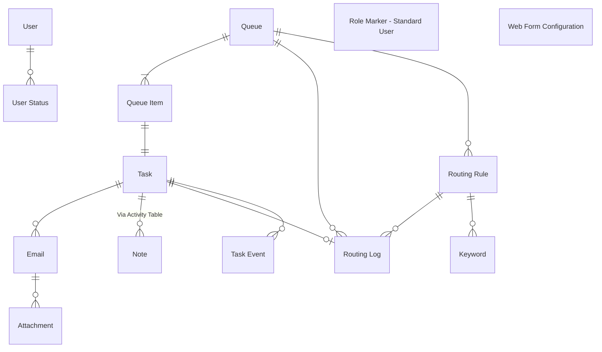

# Data Architecture
This document describes the Dataverse data architecture underpinning the base task management solution. It provides an overview of the core tables, their purpose, key fields, business logic, integrations, and the design decisions that shape the model. The architecture supports the ingestion of emails from shared mailboxes, their transformation into actionable tasks, and the automated routing and management of those tasks across teams.

## Data Model

## Data Glossary

| Entity            | Description |
|--------------------------|-------------|
| **Activity**       | Task performed, or to be performed, by a user. An activity is any action for which an entry can be made on a calendar. |
| **Attachment**       | MIME attachment for an activity.  |
| **Email**       | Activity that is delivered using email protocols. |
| **Keyword**       | Capture keywords to search against for each routing rule. |
| **Queue**       | A list of records that require action.   |
| [**Queue Item**](#queue-item)    | A specific item in a queue, such as a task or email. |
| **Role Marker - Standard User**       | Empty table used in Ribbon Workbench to customise command bar. |
| **Routing Log**       | Record all successful attempts at routing tasks to queues. |
| **Routing Rules**       | Criteria to evaluate tasks against before assigning to a queue. |
| **Task**       | Generic activity representing an email (or multiple) to be actioned.  |
| **Task Event**       | Audit log of key actions taken against a task. |
| **User**       | Default system user table. |
| **User Status**       | Store user online/offline status for auto-allocation. |
| **Web Form Configuration**       | JSON records containing question/answer config for MoJ Web Forms.  |

## Tables
The following sections describe each table within the solution, including its purpose, core fields, key business logic, integration points, and the design decisions that shape its structure.

### Activity (activitypointer)
Task performed, or to be performed, by a user. An activity is any action for which an entry can be made on a calendar.

#### Design Decisions
- Standard Activity table used in Ribbon Workbench to remove non-task activity command buttons when viewing tasks. e.g. +New Phone Call.

### Attachment (activitymimeattachment)
MIME attachment for an activity.

#### Integrations
- Stores CSV and PDF files provided by MoJ Form submissions, uploaded via `Create Task From Web Form Submission` cloud flow.
- Task attachments displayed on MoJ Form submission using 'Attachments' control on Dataverse form.

#### Design Decisions
- No customisations applied to default table, other than the disabling of table property 'Appear in search results', so that attachments do not display when searching in the model-driven app using Dataverse search.

### Email (email)
Activity that is delivered using email protocols.

#### Core Fields
- Is Initial Outbound (Yes/no) - Indicates whether an email is a new outbound message, if so set to true. Previously used in triggering `Create Task From Outgoing Email` cloud flow.
- Task (Lookup) - Associated task created as a result of ingesting this email. Set in all 3 ingestion cloud flows:
    - `Create Task From Incoming Email`
    - `Create Task From Outgoing Email`
    - `Create Task From Web Form Submission`

#### Business Logic
- The 'Subject' field is always required when sending a new email, set by the business rule `Make Subject Required When Sending an Email`.
- Additionally, the 'Subject' is set to "Draft" when creating a new outbound email (If 'Subject' is empty), defined by the `Set Default subject for new email` business rule.
- For incoming emails, a classic workflow `Set Default Email Subject/Body` sets either the 'Subject' or 'Body' to '(No Subject) or (No Body), to ensure both fields always contain data to avoid user confusion.

#### Integrations
- Emails are auto-created by server-side synchronisation whenever an email is recieved to a shared mailbox.

#### Design Decisions
- Standard Email table used to align with Microsoft ecosystem, due to OOTB integrations.
- Includes many Ribbon Workbench customisations to hide most command bar buttons.

### Keyword (tsk_keyword)
Captures keywords to search against for each routing rule.

#### Core Fields
- Keyword (Single line of text) - Term or phrase to match a routing rule against.
- Routing Rule (Lookup) - Associated Routing Rule.

#### Integrations
- Used by routing logic (`Route Task (Incoming Email) To Queue`) within Power Automate

### Queue (queue)
A list of records that require action.

#### Core Fields
- Auto Allocation Enabled (Yes/no) - When set to 'Yes', tasks belonging to this queue can be auto-allocated to online users.
- Exclude From Routing (Yes/no) - Prevent tasks from being automatically routed when set to 'Yes'.
- No Match Queue (Lookup) - Fallback queue if no matches are found from routing engine.
- Parent Queue (Lookup) - Group queues by area/team, so that tasks arriving into a parent queue, can only be routed to the child queues of the receiving queue.
- SLA Days (Whole number) - Used to calculate the due date of the task/queue item, based on date received.

#### Business Logic
- Parent queue is mandatory, if `Reply from No-Reply` equals 'No', set by `Parent Queue Requirement set by Reply From field` business rule.
- Prevent user from setting a 'No Match Queue' for accepting queues, or those excluded from routing. Defined by `No Match Queue Required Base on Incoming Email`
- Default `Type` to 'Private' when creating a new queue. Set via the business rule: `Set Type to Private for New Queues`.

### Queue Item (queueitem)
A specific item in a queue, such as a task or email.

#### Core Fields
- Due Date (Date and time) - Target completion date, based on date received + SLA of assigned queue.
- Previous Worked By (Lookup) - Records the pre-image `Worked By` value before it changes. Used by auto allocation to assign a new task when a queue item is unassigned.
- Worked By (Lookup) - Shows who is working on the queue item.

#### Business Logic
- The previous `Worked By` value is captured by a classic workflow (`QueueItem Last Worked By`) which runs before the 'Worked By' field is modified and saved. This is used to support auto-allocation.
- `Queue Item Sync (Queue)` and `Queue Item Sync (Worked By)` are two classic workflows used to set the `Due Date` and update the related Task `Owner`, based on changes to the queue item, to keep both records synchronised. The `Due Date` is calculated using the 'UltimateWorkFlowToolkit' solution.

#### Integrations
- A task is routed to a queue (thus creating a queue item) via 2 key Power Automate cloud flows:
    - `Route Task (Incoming Email) To Queue`
    - `Route Task (MoJ Form) To Queue`
- Once created, queue items can be modified using multiple OOTB and custom command buttons, see documentation on command ribbons.
- The auto allocation feature revolves around re-assigning the 'Worked By' field to users to streamline task management. This is handled via several cloud flows:
    - `Auto Allocation Get Next Task`
    - `Auto Allocation Assign on Unassignment`
    - `Auto Allocation Unassign`

#### Design Decisions
- When an email arrives in a shared mailbox and is synchronised to Dataverse, a queue item is automatically created, linking the email to the accepting queue. The decision was taken to remove these email-based queue items to avoid confusion with task-based queue items. The email-based queue items are deleted as part of the 2 ingestion flows which trigger the child flow `Delete Email Queue Item Loop (Child)`. These are also cleaned up via a nightly batch job running as a cloud flow: `QueueItems - Nightly Email Cleanup`.
- Previously the out-of-the-box command button 'Route' allowed users to remove queue items from queues. This button was hidden (via Ribbon Workbench) and replaced with a button that appears the same, but launches a custom pop-up, allowing users to re-assign the `Queue` & `Worked By`, without removing it from a queue entirely.

### Role Marker - Standard User (tsk_rolemarkerstandarduser)
Dummy table used in Ribbon Workbench to create display rules for showing/hiding the 'Release' button on Queue Items.

#### Design Decisions
- Unclear on use case of building empty/dummy table vs customising the JavaScript to check permissions before executing.

### Routing Log (tsk_routinglog)
Records all successful attempts at routing tasks to queues.

#### Core Fields
- Assigned Queue (Lookup) - Queue that the task was routed to.
- Matched Rules (Whole number) - Number of routing rules successfully matched for Web Form Tasks.
- Rule Name (Single line of text) - Name of Routing Rule that was used to route the task/queue item to the assigned queue.

#### Integrations
- Used for monitoring purposes, a record is created in the `Routing Log` table as the last action in both routing cloud flows `Route Task (Incoming Email) To Queue` and `Route Task (MoJ Form) To Queue`

#### Design Decisions
- Separate logging table created to provide auditability

---

### Routing Rules (new_routingrules)
Criteria to evaluate tasks against before assigning to a queue.

#### Core Fields
- Name (Text) — Rule name
- Priority (Number) — Order of evaluation

#### Business Logic
- Rules are evaluated sequentially to determine queue assignment

#### Integrations
- Used by Power Automate routing flows

#### Design Decisions
- Rules externalised into a table for configurability and maintainability

---

### Task (task)
Generic activity representing an email (or multiple) to be actioned.

#### Core Fields
- Subject (Text) — Task description
- Status (Choice) — Current state
- Regarding (Lookup) — Related record

#### Business Logic
- Tasks are created from emails and routed to queues
- Task status drives workflow behaviour

#### Integrations
- Power Automate handles routing, assignment, and notifications

#### Design Decisions
- Standard Task table used to align with activity model

---

### Task Event (new_taskevent)
Audit log of key actions taken against a task.

#### Core Fields
- Task (Lookup) — Related task
- Event Type (Choice) — Type of action
- Timestamp (Datetime) — When event occurred

#### Business Logic
- Events are recorded for key lifecycle actions

#### Integrations
- Used for reporting and traceability

#### Design Decisions
- Custom audit table used to supplement standard auditing

---

### User (systemuser)
Default system user table.

#### Core Fields
- Full Name (Text) — User name
- Business Unit (Lookup) — Organisation structure

#### Business Logic
- Users own records and actions within the system

#### Integrations
- Integrated with Azure AD / Entra ID

#### Design Decisions
- Standard system user entity used

---

### User Status (new_userstatus)
Stores user online/offline status for auto-allocation.

#### Core Fields
- User (Lookup) — Related system user
- Status (Choice) — Online / Offline

#### Business Logic
- Status determines whether a user can receive new tasks

#### Integrations
- Power Automate uses status for auto-assignment

#### Design Decisions
- Custom table created to support workload distribution logic

---

### Web Form Configuration (new_webformconfiguration)
JSON records containing question/answer configuration for MoJ Web Forms.

#### Core Fields
- Name (Text) — Configuration name
- JSON Payload (Multiline Text) — Form definition

#### Business Logic
- JSON defines dynamic form structure and behaviour

#### Integrations
- Consumed by external web form services

#### Design Decisions
- JSON-based approach used for flexibility and rapid changes without schema updates