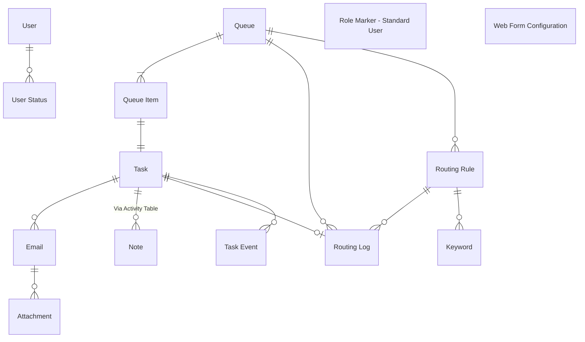

# Data Architecture
This document describes the Dataverse data architecture underpinning the base task management solution. It provides an overview of the core tables, their purpose, key fields, business logic, integrations, and the design decisions that shape the model. The architecture supports the ingestion of emails from shared mailboxes, their transformation into actionable tasks, and the automated routing and management of those tasks across teams.

## Data Model

## Data Glossary

| Entity            | Description |
|--------------------------|-------------|
| **Activity**       | Task performed, or to be performed, by a user. An activity is any action for which an entry can be made on a calendar. |
| **Attachment**       | MIME attachment for an activity.  |
| **Email**       | Activity that is delivered using email protocols. |
| **Keyword**       | Capture keywords to search against for each routing rule. |
| **Queue**       | A list of records that require action.   |
| [**Queue Item**](#queue-item)    | A specific item in a queue, such as a task or email. |
| **Role Marker - Standard User**       | Empty table used in Ribbon Workbench to customise command bar. |
| **Routing Log**       | Record all successful attempts at routing tasks to queues. |
| **Routing Rules**       | Criteria to evaluate tasks against before assigning to a queue. |
| **Task**       | Generic activity representing an email (or multiple) to be actioned.  |
| **Task Event**       | Audit log of key actions taken against a task. |
| **User**       | Default system user table. |
| **User Status**       | Store user online/offline status for auto-allocation. |
| **Web Form Configuration**       | JSON records containing question/answer config for MoJ Web Forms.  |

## Tables
The following sections describe each table within the solution, including its purpose, core fields, key business logic, integration points, and the design decisions that shape its structure.

### Activity (activitypointer)
Task performed, or to be performed, by a user. An activity is any action for which an entry can be made on a calendar.

#### Design Decisions
- Standard Activity table used in Ribbon Workbench to remove non-task activity command buttons when viewing tasks. e.g. +New Phone Call.

### Attachment (activitymimeattachment)
MIME attachment for an activity.

#### Integrations
- Stores CSV and PDF files provided by MoJ Form submissions, uploaded via `Create Task From Web Form Submission` cloud flow.
- Task attachments displayed on MoJ Form submission using 'Attachments' control on Dataverse form.

#### Design Decisions
- No customisations applied to default table, other than the disabling of table property 'Appear in search results', so that attachments do not display when searching in the model-driven app using Dataverse search.

### Email (email)
Activity that is delivered using email protocols.

#### Core Fields
- Is Initial Outbound (Yes/No) - Indicates whether an email is a new outbound message, if so set to true. Previously used in triggering `Create Task From Outgoing Email` cloud flow.
- Task (Lookup) - Associated task created as a result of ingesting this email. Set in all 3 ingestion cloud flows:
    - `Create Task From Incoming Email`
    - `Create Task From Outgoing Email`
    - `Create Task From Web Form Submission`

#### Business Logic
- The 'Subject' field is always required when sending a new email, set by the business rule `Make Subject Required When Sending an Email`.
- Additionally, the 'Subject' is set to "Draft" when creating a new outbound email (If 'Subject' is empty), defined by the `Set Default subject for new email` business rule.
- For incoming emails, a classic workflow `Set Default Email Subject/Body` sets either the 'Subject' or 'Body' to '(No Subject) or (No Body), to ensure both fields always contain data to avoid user confusion.

#### Integrations
- Emails are auto-created by server-side synchronisation, whenever an email is recieved to a shared mailbox.

#### Design Decisions
- Standard Email table used to align with Microsoft ecosystem, due to OOTB integrations.
- Includes many Ribbon Workbench customisations to hide most command bar buttons.

### Keyword (new_keyword)
Captures keywords to search against for each routing rule.

#### Core Fields
- Name (Text) — Keyword value
- Routing Rule (Lookup) — Associated rule

#### Business Logic
- Keywords are evaluated against incoming content during routing

#### Integrations
- Used by routing logic within Power Automate

#### Design Decisions
- Separate table used to allow flexible keyword management

---

### Queue (queue)
A list of records that require action.

#### Core Fields
- Name (Text) — Queue name
- Owner (User/Team) — Responsible party

#### Business Logic
- Queues group actionable items for users or teams

#### Integrations
- Used by routing flows and task assignment logic

#### Design Decisions
- Standard Queue table leveraged to utilise built-in queue capabilities

---

### Queue Item (queueitem)
A specific item in a queue, such as a task or email.

#### Core Fields
- Queue (Lookup) — Defines the queue the item is assigned to

#### Business Logic
- Queue Items are automatically created when activities (e.g. tasks or emails) are routed into a queue  

#### Integrations
- Power Automate flows monitor Queue Items for assignment and escalation scenarios

#### Design Decisions
- Standard Dataverse Queue Item table is used to leverage built-in queue management capabilities

---

### Role Marker - Standard User (new_rolemarkerstandarduser)
Empty table used in Ribbon Workbench to customise command bar.

#### Core Fields
- N/A — No functional fields

#### Business Logic
- Used purely as a marker for enabling/disabling UI commands

#### Integrations
- Referenced in Ribbon Workbench customisations

#### Design Decisions
- Dummy table created to work around platform limitations in command bar customisation

---

### Routing Log (new_routinglog)
Records all successful attempts at routing tasks to queues.

#### Core Fields
- Task (Lookup) — Related task
- Queue (Lookup) — Destination queue
- Timestamp (Datetime) — When routing occurred

#### Business Logic
- Logs are created whenever routing succeeds

#### Integrations
- Used by monitoring and reporting processes

#### Design Decisions
- Separate logging table created to provide auditability

---

### Routing Rules (new_routingrules)
Criteria to evaluate tasks against before assigning to a queue.

#### Core Fields
- Name (Text) — Rule name
- Priority (Number) — Order of evaluation

#### Business Logic
- Rules are evaluated sequentially to determine queue assignment

#### Integrations
- Used by Power Automate routing flows

#### Design Decisions
- Rules externalised into a table for configurability and maintainability

---

### Task (task)
Generic activity representing an email (or multiple) to be actioned.

#### Core Fields
- Subject (Text) — Task description
- Status (Choice) — Current state
- Regarding (Lookup) — Related record

#### Business Logic
- Tasks are created from emails and routed to queues
- Task status drives workflow behaviour

#### Integrations
- Power Automate handles routing, assignment, and notifications

#### Design Decisions
- Standard Task table used to align with activity model

---

### Task Event (new_taskevent)
Audit log of key actions taken against a task.

#### Core Fields
- Task (Lookup) — Related task
- Event Type (Choice) — Type of action
- Timestamp (Datetime) — When event occurred

#### Business Logic
- Events are recorded for key lifecycle actions

#### Integrations
- Used for reporting and traceability

#### Design Decisions
- Custom audit table used to supplement standard auditing

---

### User (systemuser)
Default system user table.

#### Core Fields
- Full Name (Text) — User name
- Business Unit (Lookup) — Organisation structure

#### Business Logic
- Users own records and actions within the system

#### Integrations
- Integrated with Azure AD / Entra ID

#### Design Decisions
- Standard system user entity used

---

### User Status (new_userstatus)
Stores user online/offline status for auto-allocation.

#### Core Fields
- User (Lookup) — Related system user
- Status (Choice) — Online / Offline

#### Business Logic
- Status determines whether a user can receive new tasks

#### Integrations
- Power Automate uses status for auto-assignment

#### Design Decisions
- Custom table created to support workload distribution logic

---

### Web Form Configuration (new_webformconfiguration)
JSON records containing question/answer configuration for MoJ Web Forms.

#### Core Fields
- Name (Text) — Configuration name
- JSON Payload (Multiline Text) — Form definition

#### Business Logic
- JSON defines dynamic form structure and behaviour

#### Integrations
- Consumed by external web form services

#### Design Decisions
- JSON-based approach used for flexibility and rapid changes without schema updates