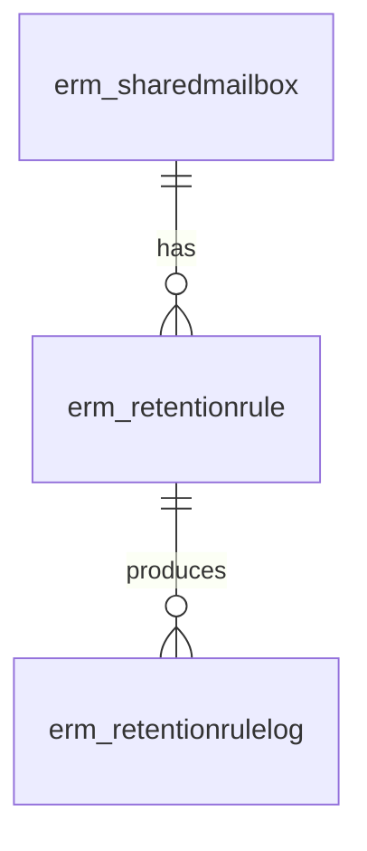
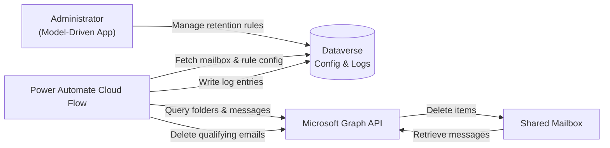
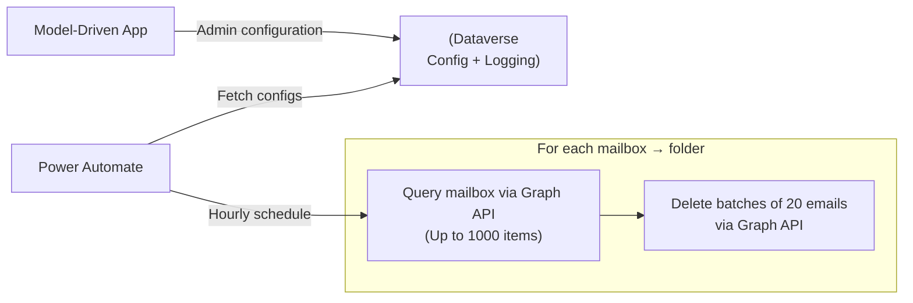
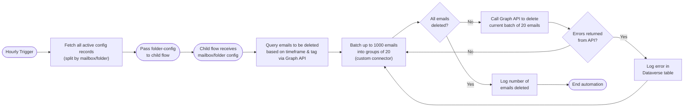

# High‑Level Design (HLD)
This document provides a high-level architectural overview of the Email Retention Management (ERM) solution, including it's purpose and core components.

>This HLD is intended for architects, administrators, developers and delivery teams working with or supporting the solution.

## Project Background

### Purpose 
The Email Retention Management (ERM) solution provides automated governance and lifecycle management for shared mailboxes by enforcing retention rules, identifying qualifying emails, and removing them based on configurable policies. The solution replaces legacy VBA code used to regularly clean-up shared mailboxes.

### References

| Title                                                       | Description             | Link                                            |
|-------------------------------------------------------------|-------------------------|-------------------------------------------------|
| DSO Email Deletion Process                                  | JIRA Epic for Project   | https://tools.hmcts.net/jira/browse/DTSRPA-2500 |
| Enable "Delete Emails after Processing" option in mailboxes | Original Demand Request | https://hmcts.haloitsm.com/ticket?id=97784      |

## Business Architecture

### Business Process
Shared mailboxes often accumulate large volumes of incoming emails, causing storage issues and operational inefficiencies. Manual clean‑up required the use of VBA scripts to clear folders of specific inboxes.

### Problem Statement
The existing solution is reaching end-of-life support and requires manual interaction to maintain mailbox capacity. The proposed Power Platform solution automates and centralises retention enforcement to ensure emails are automatically deleted on a regular basis.

### Requirements
The requirements captured below were created based on information provided via the initial service request ([SR-0097784](https://hmcts.haloitsm.com/ticket?id=97784)) and Tech Questionnaire.

#### Functional
|ID |Title |Description |
|-|-|-|
|DTSRPA-2501|Configure mailbox record |As a Mailbox Administrator, I want to create and manage a mailbox configuration record containing a typed mailbox address and activation status, so that the system knows which mailboxes are available for retention management.|
|DTSRPA-2502|Configure folder-level rules |As a Mailbox Administrator, I want to configure separate retention settings for folders such as Inbox and Sent Items within a mailbox, so that different types of emails are retained or deleted according to their operational and regulatory importance.|
|DTSRPA-2503|Delete processed emails automatically|As a Mailbox Administrator, I want the system to automatically delete emails that have been processed and synchronized with Dynamics 365 once they exceed their configured retention window, so that mailbox sizes are controlled without deleting unprocessed emails.|
|DTSRPA-2504|View retention cleanup logs |As a Mailbox Administrator, I want to view summary logs showing how many emails were evaluated and deleted during retention cleanup, so that I can verify the system is operating correctly without exposing the content of individual emails.|

#### Non-functional
- **Performance & Efficiency** - The solution must process each configured mailbox within the scheduled flow window, completing Graph API queries and deletion operations without exceeding platform timeouts or throttling limits.

- **Scalability** - The solution must support onboarding additional shared mailboxes and retention rules without requiring architectural changes or causing performance degradation.

- **Email Throughput** - The solution must be able to handle 7.5k - 10k emails per day.

- **Security & Access Control** - All components must enforce least‑privilege access, ensuring only authorised roles and service accounts can configure retention settings or access mailbox data.

- **Auditability & Traceability** - Every deletion action must be logged with mailbox, metadata, and applied retention rule details to provide a complete and transparent audit trail.

- **Reliability & Resilience** - Cloud flows must handle transient errors (e.g., Graph throttling or Dataverse delays) using retry policies and fail predictably with clear error visibility for administrators.

### RAID Log
#### Risks
| ID  | Risk                          | Description                                                                                                 |
|-----|--------------------------------|-------------------------------------------------------------------------------------------------------------|
| R1  | Graph API Throttling          | High‑volume or large shared mailboxes may cause Microsoft Graph API throttling, delaying or interrupting processing. |
| R2  | Misconfigured Retention Rules | Incorrect or overly broad retention rules may result in unintended email deletions.                        |
| R3  | Permission Changes            | Unexpected changes to mailbox or Graph API permissions may prevent flows from running successfully.         |

#### Assumptions

| ID  | Assumption                          | Description                                                                                      |
|-----|--------------------------------------|--------------------------------------------------------------------------------------------------|
| A1  | Mailbox Access is Maintained         | Required shared mailboxes remain licensed and correctly permissioned for the service account.   |
| A2  | Mailboxes Hosted in Exchange Online      | All targeted shared mailboxes are cloud‑based in Exchange Online, ensuring compatibility with Microsoft Graph API operations.            |
| A3  | Stable Mailbox Volumes               | Mailbox sizes remain within expected ranges to complete processing within scheduling windows.   |

#### Issues

| ID  | Issue                        | Description                                                                                               |
|-----|------------------------------|-----------------------------------------------------------------------------------------------------------|
| I1  | Folder-Level Limitations     | Graph API limitations in complex or deeply nested folder structures may restrict retention targeting.    |

#### Decisions

| ID  | Decision                       | Description                                                                                                             |
|-----|--------------------------------|-------------------------------------------------------------------------------------------------------------------------|
| D1  | Use Permanent Delete for Retention Enforcement | Emails are permanently deleted rather than soft‑deleted to ensure mailbox storage is actually reduced and retention objectives are met, as soft‑deleted items continue to consume storage. An environment variable was added to provide the option of soft-deleting emails for testing purposes.   |

## Data Architecture
The data model consists of three core entities: Shared Mailbox, Retention Rule, and Retention Rule Log. Shared Mailbox stores mailbox identities and links to Retention Rules that define deletion criteria, while Retention Rule Log is implemented as an elastic table to handle high‑volume, append‑only execution results efficiently and to support scalable logging without affecting Dataverse performance.

### Data Model

### Data Glossary

| Entity            | Description |
|--------------------------|-------------|
| **Shared Mailbox**       | Represents a shared mailbox configured for retention management, including its display name and email address. |
| **Retention Rule**       | A configuration record that defines how retention should be applied to a specific shared mailbox, including folder, scope, and retention duration in days. |
| **Retention Rule Log**   | A log entry produced each time a retention rule is executed, capturing the number of emails processed, failures, errors (if any), and the timestamp of execution. |

### Data Flow

## Solution Design
The ERM solution is built using Microsoft Power Platform and automates the scanning, evaluation, and deletion of emails within shared mailboxes. Administrators (within the Low Code Platform Team) configure mailboxes and retention rules through a model‑driven app, while Power Automate flows execute scheduled, automated processes against Microsoft's Graph API.

### High-Level Architecture

The model‑driven app provides administrators with an easy interface to configure retention settings and review activity logs, while the Dataverse tables serve as the central source of configuration and the repository for all logging. Scheduled cloud flows use this configuration to retrieve mailbox details, query shared mailboxes via Microsoft Graph, evaluate emails against retention rules, delete those that meet the criteria, and record all actions back into Dataverse.

### Solution Components
- **Model‑Driven App** - Managing configuration, retention settings, and reviewing logs.
- **Dataverse Tables** - Storing mailbox definitions, retention policies, and deletion logs.
- **Power Automate Cloud Flows** - Scan mailboxes, evaluate email age, delete qualifying emails, and log actions.
- **Microsoft Graph API** - Used by flows to read and delete mailbox content securely.

### Processes

#### Mailbox Retention Processing Workflow
The `Trigger Mailbox Email Retention` flow runs on an hourly schedule, retrieves all active mailbox-folder configurations, and sends each one to the child flow, `Get Emails And Delete`, for processing. 

The child flow queries emails that meet the retention criteria, batches them into groups of 20, and repeatedly deletes each batch using the Graph API while logging any errors, until all qualifying emails are removed and the final deletion count is written to Dataverse.

### Integrations
#### Microsoft Graph API
Microsoft Graph is used to securely query and permanently delete emails from shared mailboxes, enabling the solution to retrieve message metadata and enforce retention rules programmatically.

Authentication is via the `HTTP With Entra ID` connector between the service account and shared mailbox.

| API Endpoint | Purpose | Key Parameters / Notes |
|--------------|----------|-------------------------|
| **GET /users /{mailbox} /mailFolders /{folder} /messages** | Retrieves up to 1,000 messages from the specified mailbox folder, filtered by retention window and (optionally) Dynamics 365 tracking category. | - **mailbox** → mailbox email address from Dataverse config - **folder** → configured folder name (Inbox or SentItems)  - **$top=1000** → maximum items returned - **$select=id** → retrieves message IDs only for efficiency - **$filter** → lastModifiedDateTime \< (now - retentionDays) - Conditional filter: `categories/any(c:c eq 'Tracked to Dynamics 365')` when scope = 2 |
| **POST /$batch** | Sends multiple delete commands in a single request for performance and throttling reduction. | - Depending on the environment variable set, each batch item issues either a soft delete or hard delete. Hard delete:   **POST /users /{mailbox} /messages /{emailId} /microsoft.graph.permanentDelete** Soft delete:  **DELETE /users /{mailbox} /messages /{emailid}**  - Supports batching of up to 20 deletes per child‑flow cycle - Used after message IDs are grouped into batches |

### Security
#### Service Accounts
For any environment the solution is hosted within, an Entra ID service account must be used to manage the solution, including ownership of any connection references.

#### Dataverse Roles
Currently, no custom security roles have been created for this solution. The expectation is the app will be used by the Low Code Platform Team to manage mailbox retention policies, without granting access to end-users. Any user wishing to access the solution should do so via a default security role, such as System Administrator.