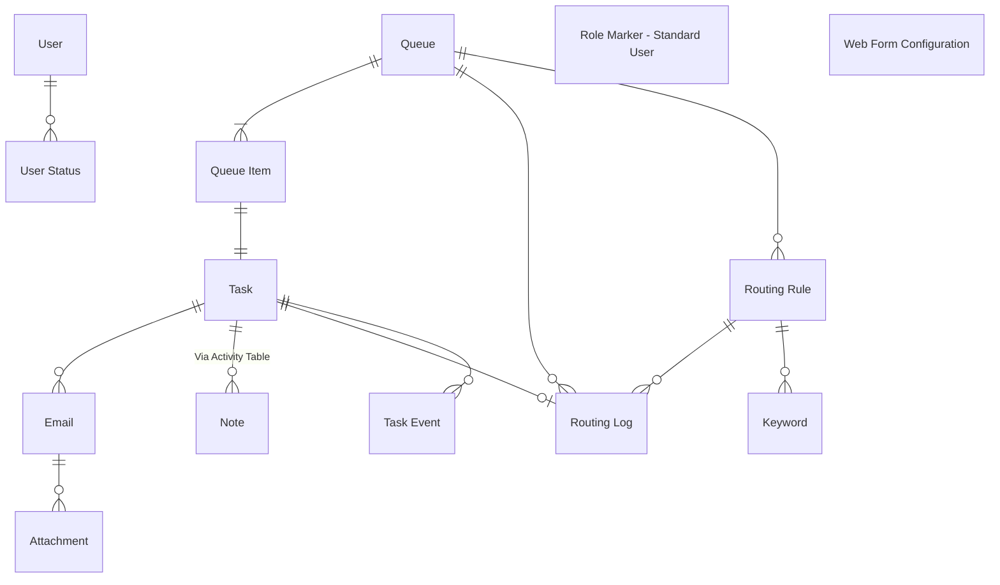
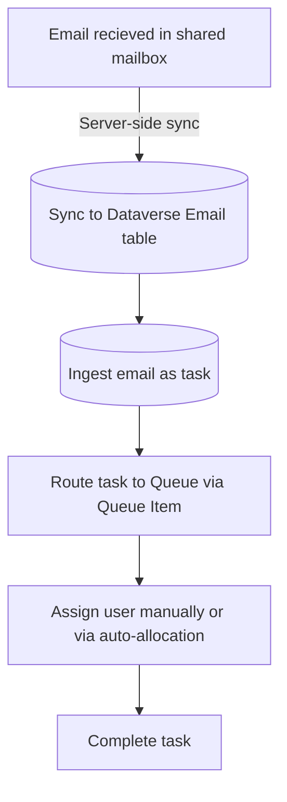
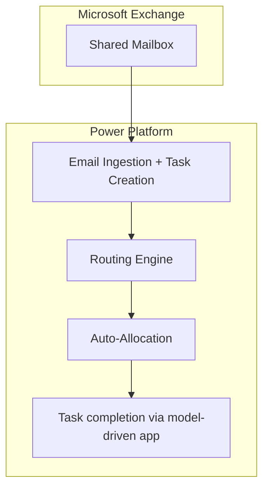
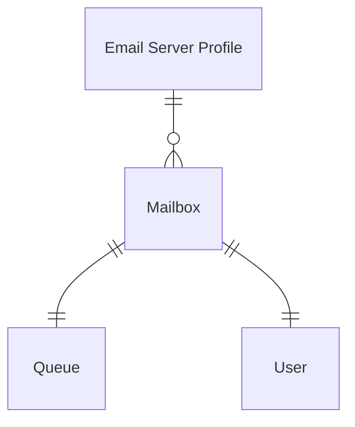

# High‑Level Design (HLD)
This document provides a high-level architectural overview of the base task management solution, including it's purpose and core components.

>This HLD is intended for architects, administrators, developers and delivery teams working with or supporting the solution for use on other task management solutions.

## Project Background

### Purpose 

The base task management solution serves as the starting foundations for all future task management solutions, including MEBC and Tax email management.

The solution works without any additional development but is expected to be deployed as unmanaged to a new environment, before being adapted to each email & task management project that comes through the low code platform team.

Many teams across HMCTS experience large numbers of emails into shared mailboxes, which often become difficult to manage and assign. The task management base solution connects to the shared mailbox via server-side synchronisation, and processes all incoming emails into actionable tasks, assigned to the correct team through routing rules.

### References

| Title                                                       | Description             | Link                                            |
|-------------------------------------------------------------|-------------------------|-------------------------------------------------|
| CNBC epic | Original JIRA epic used to develop the base solution   | https://tools.hmcts.net/jira/browse/DTSRPA-601 |
| Power Platform development environment | Current environment for making changes | https://make.powerapps.com/environments/c48b3376-9d1b-efeb-9da6-42c9adad53a4      |


### Stakeholders
|Name|Area|Role|
|-|-|-|
|Tom Vine|Low Code Platform Team| Developer


## Business Architecture

### Business Process
As an example, the Civil National Business Centre (CNBC) team have 23 separate email inboxes, which recieves hundreds of emails each day to support the early administrative and processing stages of county court claims.

### Problem Statement
Continuing with the CNBC example, the volume of emails arriving across the 23 mailboxes became difficult to manage, with users running into frequent API issues and Outlook crashes.

### Requirements
The requirements below have been written up retrospectively based on the current implementation of CNBC, as a guide for other task & email management solutions.

#### Functional
|ID |Title |Description |
|-|-|-|
|TBC| TBC|TBC|


#### Non-functional
- **TBC** - TBC

### RAID Log
#### Risks
| ID  | Risk                          | Description                                                                                                 |
|-----|--------------------------------|-------------------------------------------------------------------------------------------------------------|
| R1  | Dataverse Throttling          | High‑volume of incoming emails may hinder Power Automate & Dataverse performance. Since CNBC, several performance changes have been made to reduce billable actions. |
| R2  | Misconfigured Routing Rules | Incorrect or overly broad routing rules may result in tasks being assigned an incorrect queue & user. The option to re-run routing rules for multiple queue items was added to the solution, especially beneficial in early hypercare periods.                        |

#### Assumptions

| ID  | Assumption                          | Description                                                                                      |
|-----|--------------------------------------|--------------------------------------------------------------------------------------------------|
| A1  | Project specific discovery & requirements         | Each implementation of the task management base should still conduct thorough and fair discovery, including requirements gathering, before aligning with the base solution.   |


#### Issues

| ID  | Issue                        | Description                                                                                               |
|-----|------------------------------|-----------------------------------------------------------------------------------------------------------|
| I1  | None documented     |   |

#### Decisions

| ID  | Decision                       | Description                                                                                                      |
|-----|--------------------------------|-------------------------------------------------------------------------------------------------------------------------|
| D1  | Deploy base solution as unmanaged and customise | The original approach was to host the base solution in a development environment and deploy to project-specific development environments as a managed solution, with project-specific customisations applied in a separate solution. This quickly became cumbersome, with each development requiring a change to the base solution, so the decision was taken to deploy the base solution as unmanaged without any dependencies.   |

## Data Architecture
The data model consists of fourteen core entities, a mix of standard and custom Dataverse tables, based on the structure of tasks and queues.

### Data Model


### Data Glossary

| Entity            | Description |
|--------------------------|-------------|
| **Activity**       | Relate Notes to Tasks |
| **Attachment**       | Store files against email records.  |
| **Email**       | Ingested emails from shared mailboxes using server-side synchronisation |
| **Keyword**       | Capture keywords to search against for each routing rule |
| **Queue**       | A list of records that require action   |
| **Queue Item**       | A specific item in a queue, such as a task or email |
| **Role Marker - Standard User**       | Empty table used in Ribbon Workbench to customise command bar |
| **Routing Log**       | Record all successful attempts at routing tasks to queues |
| **Routing Rules**       | Criteria to evaluate tasks against before assigning to a queue |
| **Task**       | Generic activity representing an email (or multiple) to be actioned  |
| **Task Event**       | Audit log of key actions taken against a task |
| **User**       | Default system user table |
| **User Status**       | Store user online/offline status for auto-allocation |
| **Web Form Configuration**       | JSON records containing question/answer config for MoJ Web Forms  |

### Data Flow



## Solution Design
The ERM solution is built using Microsoft Power Platform and automates the scanning, evaluation, and deletion of emails within shared mailboxes. Administrators (within the Low Code Platform Team) configure mailboxes and retention rules through a model‑driven app, while Power Automate flows execute scheduled, automated processes against Microsoft's Graph API.

The base task management solution is built using Microsoft Power Platform and connects to Microsoft Exchange using server-side synchronisation, to ingest emails into the application. Users automatically pick up newly assigned tasks and action them outside of the app, marking them as complete once finished. The solution makes use of many out-of-the-box features include queues/queue items and task management.

### High-Level Architecture


 Scheduled cloud flows use this configuration to retrieve mailbox details, query shared mailboxes via Microsoft Graph, evaluate emails against retention rules, delete those that meet the criteria, and record all actions back into Dataverse.

The model-driven app provides case workers with an easy interface to view and manage their assigned tasks whilst administrators can configure routing rules and re-route items to the correct team or queue.

Classic workflows are leveraged to ensure quality data hygiene whilst Power Automate flows carry out the bulk of processing from ingestion and routing, to auto-allocation and data capacity maintenance.

### Solution Components
Below are the key Power Platform components, excluding those used in governance and configuration (such as environment variables, connection references).

- **Model-Driven App** - Email and task handling, queue maintenance and routing rule development
- **AI Model** - Adoption of a custom prompt to extract hearing dates from the incoming email body text
- **Canvas App** - JSON query builder is nested on the routing rule form, to build JSON queries for routing MoJ form tasks
- **Cloud Flows** - Task creation, routing, auto-allocation and data hygiene tasks
- **Component library** - Managing Power Fx command bar buttons applied to tasks, queue items and routing rules
- **Pages** - Custom pages used to provide additional functionality for auto-allocation and routing tasks to queues within the model-driven app
- **Processes** - Supporting and managing data hygiene in real-time
- **Dataverse Tables** - Store Email and Task data, routing rule metadata, task-queue assignments and user status data for auto-allocation

### Concepts

#### Email Ingestion
A vital part of the solution is configuration of the email server profile to pick up emails that arrive into a shared mailbox being used by caseworkers and team members. This ingestion uses the [server-side synchronisation](https://learn.microsoft.com/en-us/power-platform/admin/server-side-synchronization) feature which processes received emails and creates them in the 'Email' Dataverse table.


Similarly, if a user sends an email from within the model-driven app, then a record is added to the email table, before it is sent via Microsoft Exchange.

The classic workflow `Set Default Email Subject/Body` automatically sets the body or subject of an incoming email to "(None)" if either field is blank upon receipt. This ensures there is always a string for future automations to use and avoid user confusion.

#### Queue Configuration
Each implementation of the base solution will usually include multiple shared inboxes. As described in the previous section, every shared mailbox will have it's own dedicated queue which accepts the initial email coming in.

From here, a newly created task can be routed to many other queues and types depending on the body, subject and sender of the email.

Each parent queue will have a number of direct child queues which split out the tasks and work into dedicated groups, based on how the team operates. These child queue relationships are defined when the `Parent Queue` property of a queue is defined.

For each parent queue, the application would expect a corresponding 'No Match' queue to be created. This queue still has the `Parent Queue` field defined as the parent queue, but the `No Match Queue` field on the parent queue must also be set. This is consumed in the routing logic below, where if no routing rules are matched, the automation will fallback and assign the task to the no match queue, which can be reviewed by admins to improve the routing logic and keywords. 

```mermaid
flowchart TD

  %% Global Queues across the top
  subgraph GQ["Global Queues (No Parent Queue Assigned)"]
    direction LR
    G1["Email Loop (Hide auto-replies etc)"]
    G2["Accessibility (?)"]
  end

  %% Team A
  subgraph TA["Team A"]
    direction TB
    A1["Shared Mailbox"]
    A2["Parent Queue (Accepting Queue)"]
    A3["No Match Queue"]
    A4["Child Queue A"]
    A5["Child Queue B"]
    A6["Child Queue C"]

    A1 --> A2
    A2 --> A4
    A2 --> A5
    A2 --> A6
    A2 -- Lookup on Parent Queue --> A3
  end

  %% Team B
  subgraph TB["Team B"]
    direction TB
    B1["Shared Mailbox"]
    B2["Parent Queue (Accepting Queue)"]
    B3["No Match Queue"]
    B4["Child Queue A"]
    B5["Child Queue B"]
    B6["Child Queue C"]

    B1 --> B2
    B2 --> B4
    B2 --> B5
    B2 --> B6
    B2 -- Lookup on Parent Queue --> B3
  end

  %% Dotted non-directional relationships to Global Queues
  A2 -.-> GQ 
  B2 -.-> GQ

  %% Correctly style ONLY the last two links
  linkStyle 10,11 stroke-dasharray: 5 5, stroke:#999, stroke-opacity:0.6;

  %% Styling for Shared Mailboxes
  classDef mailbox fill:#eeeeee,stroke:#999999,color:#333,stroke-width:1px;50
  class A1,B1 mailbox;
  ```

Outside of each team's subset of parent and child queues, there must be a globally accessible queue for email loops and accessibility. The global email loop queue is designed to collect all emails that are not relevant or needed for the users in the app. This may include spam and junk emails, but also auto-replies from external senders which do not need to be actioned. The queue id for this queue is then set against the environment variable `Email Loop Detection Destination Queue`, so any future emails which meet these criteria are automatically routed to this queue across the whole app.

At the time of writing, there are no routing rules defined against the accessibility queue, and tasks requiring accessibility assistance are manually routed to this queue by a user.


#### Task Creation
All tasks in the task table are created by 3 Power Automate flows described below. Two are responsible for creating tasks for 'Email' and 'MoJ Form Submission' source types, whilst the third creates completed tasks off the back of newly sent emails by an application user.

```mermaid
flowchart TD

    A[Record added to Email table] --> B{Email source/type?}

    %% Branch 1: Incoming email / MOJ form
    B -->|"Incoming (Email or MOJ Form)"| C{Is it a regular email or MOJ form submission?}

    C -->|Regular Email| D[<b>Flow:</b> Create Task From Incoming Email]
    C -->|MOJ Form| E[<b>Flow:</b> Create Task From Web Form Submission]

    D <-->|Child flow to process HTML| L[<b>Flow:</b> Convert Email Body to Plain Text]

    D --> F[Create Task and set tsk_sendtoqueue as true]
    E --> F

    F --> G[[Trigger routing automations]]

    %% Branch 2: Outgoing email from app
    B -->|"Outgoing (Created in model-driven app)"| H{Does the email have an associated task?}

    H -->|Yes| I[Do nothing]
    H -->|No| J[<b>Flow:</b> Create Task From Outgoing Email]

    J --> K[Create Task and mark as complete]
```

The flag 'tsk_sendtoqueue' on the Task table is universally used to trigger separate routing automations, whenever a task is created that needs to be routed. Only incoming emails need to be routed as tasks to a queue.

#### Task Routing

Upon task creation, the flag 'tsk_sendtoqueue' is set to true, triggering downstream automations to route the initial task to a queue, based on routing rules which are defined for both 'Email' and 'MoJ Form Submission' source types. The basic email routing is based on keywords and pattern matching, whilst the MoJ form routing uses a defined JSON query of question-answer combinations to match against.

```mermaid
 flowchart TD
  A[<b>Flow:</b> Create Task From Incoming Email]
  B[<b>Flow:</b> Create Task From Incoming Email]
  C[<b>Flow:</b> Re-Route Tasks For Source Queue]
  D[<b>Power Fx Button: </b>'Resubmit Routing' On Queue Item Grid]
  E[Set tsk_sendtoqueue on Task table record to true]
  F{Is task source type either 'Email' or 'MoJ Form Submission?'}
  G["<b>Flow:</b> Route Task (Incoming Email) To Queue"]
  H["<b>Flow:</b> Route Task (MoJ Form) To Queue"]
  I[Route task to queue via queue item]
  J["<b>Classic Workflow:</b> Queue Item Sync (Queue)"]
  K["<b>Classic Workflow:</b> Queue Item Sync (Worked By)"]
  L[Task assigned to a queue and owner]

  A --> E
  B --> E
  C --> E
  D --> E
  E --> F
  F -- Email-type --> G
  F -- MoJ Form-type --> H
  G --> I
  H --> I
  I --> J
  I --> K
  J -- Update queue and due date against Task --> L
  K -- Update Task owner based on Queue Item 'Worked By' --> L
 ```

The goal of the automated routing is to route incoming tasks to an initial queue and user, which can be picked up by a specific member of that queue, or routed to another queue if more appropriate.

Once initially routed, users have the option of using a custom pop up (triggered by 'Route' button on Queue Item Grid) or the default command buttons 'Queue Item Details', 'Add To Queue', 'Pick' or 'Release' to assign the queue item to a new user or queue.

#### Auto-Allocation
The auto-allocation feature streamlines caseworker's workload by assigning new items to work on without team lead involvement. 

A case worker sets their status to 'Online' using the custom page 'My Online Status', which updates a record in the User Status table. This is used by various automations to assign tasks and queue items to users.

```mermaid

 flowchart TD
 A[User sets online status via custom page]
 B[<b>Flow:</b> Auto Allocation Assign]
 C[<b>Flow:</b> Auto Allocation Get Next Task]
 D[Queue Item assigned to user]
 E[Task status marked as complete or parked]
 F[<b>Flow:</b> Auto Allocation Assign on Park or Complete]
 G[User is unassigned from a Queue Item]
 H[<b>Flow:</b> Auto Allocation Assign on Unassignment]

 A --> B
 B -- Runs child flow to assign Queue Item --> C
 C -- Checks status and updates next available Queue Item --> D
 E --> F
 F -- Runs child flow to get next Queue Item--> C
 G --> H
 H -- Runs child flow to get next Queue Item--> C
```
Automatic unassignment of tasks also takes place at 2am every morning and whenever a user is marked offline but still has tasks allocated to them. These tasks are removed so that they can be re-assigned to another user who is online.

```mermaid

 flowchart TD
 A[At 02:00 each morning]
 B[<b>Flow:</b> Auto Allocation Automatic Force Offline]
 C[<b>Flow:</b> Auto Allocation Unassign]
 D[Fetch all allocated queue items and clear 'Worked By']
 E[Recurring every 1 minute]
 F[<b>Flow:</b> Auto Allocation Automatic Unassign]

 A --> B
 B -- Force all users offline and unassign any tasks --> C
 C -- Unassign all tasks and queue items for a UserId--> D
 E --> F
 F -- List all offline users and mark them as unallocated--> C
 ```


### Integrations
#### Microsoft Exchange
The system uses server-side sync with Microsoft Exchange to synchronise emails between the shared mailboxes and the Dataverse 'Email' table.

This is acheived by first creating or enabling the mailbox record in Dataverse (Advanced Settings → Email Configuration → Mailboxes) and link it to the shared mailbox email address. Then configure Server-Side Synchronization with an approved Exchange/Office 365 profile (likely an admin from MoJ), test and enable the mailbox, and set incoming email processing to "Server-Side Synchronization."

The user creating the mailbox record will need full access rights to the shared mailbox in Exchange (e.g., full access or send-as), otherwise sync and tracking won’t activate.

### Security
#### Service Accounts
For any environment the solution is hosted within, an Entra ID service account must be used to manage the solution, including ownership of any connection references and components with access to the relevant shared mailboxes for ingestion and synchronisation.

#### Shared Mailbox
Currently, there is 1 shared mailbox dedicated to the base solution, specifically for the development environment: lcpt-base-tasks-dev1@justice.gov.uk.

Any projects forking from the base solution should have a separate Power Platform development environment and shared mailbox(s) created, these can be submitted using a standard SNOW request in ServiceNow.

#### Dataverse Roles
The solution includes 6 Dataverse roles, which are grouped into 4 access teams (Rule Admins, Service Leaders, Standard Users and Team Leaders).

|Name|Purpose|
|-|-|
|Role Rules Administrator|This role is centred on the configuration of routing behaviour and provides full global control over Keywords, Routing Rules, Routing Logs, and Web Form Configurations, along with the ability to create and manage Queues required for routing. It does not provide meaningful access to Tasks, Emails, Attachments or Queue Items.|
|Role Auto Allocation Leader|This role focuses on supporting auto-allocation through management of User Status, with the ability to create, read, and update it (globally readable). However, it has no access to Tasks, Emails, Queues, Queue Items, Routing Rules, Keywords, Routing Logs, or Task Events.|
|Role Auto Allocation User|This role provides basic interaction with User Status, allowing users to create and update their own status and read it at a limited scope, supporting participation in auto-allocation. It has no access to Tasks, Emails, Queues, Queue Items, Routing Rules, Keywords, Routing Logs, or Task Events, meaning it cannot process work, and is intended only to support presence/status input within the allocation model.|
|Role Service Leader|This role provides the broadest coverage, with full control of Tasks, Emails, Attachments, Queues, and Queue Items, and strong visibility into Routing Rules, Logs, Keywords, Task Events, Users, User Status', and Web Form Configurations. It enables oversight of work flow and system usage but does not directly control Routing Rules and Keywords, relying on Rules Administrator to define routing behaviour.|
|Role Standard User|This role provides operational access to Tasks, Emails, Attachments, Queues, and Queue Items, enabling users to perform daily work. It includes visibility of Routing Rules, Logs, Keywords, Task Events, User Status', and Web Form Configurations, supporting awareness of routing and tracking. However, it cannot modify routing logic or Keywords, and has limited control over Queues.|
|Role Team Leader|This role enhances operational control with the ability to assign and coordinate Tasks, Emails, Queues, and Queue Items across teams. It has full visibility of Routing Rules, Logs, Keywords, Task Events, and Web Form Configurations, supporting workload monitoring. It cannot modify Routing Rules or Keywords.|

