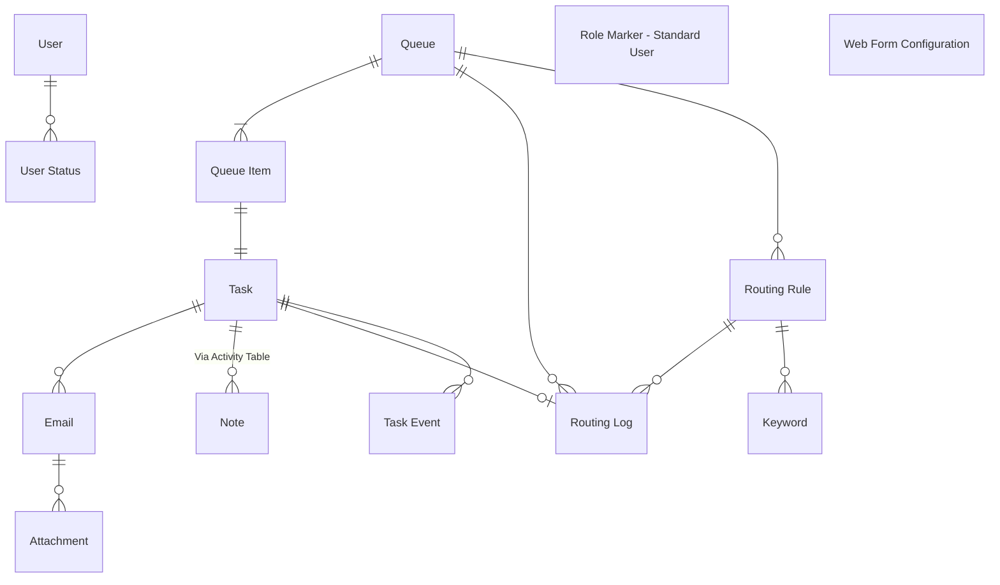
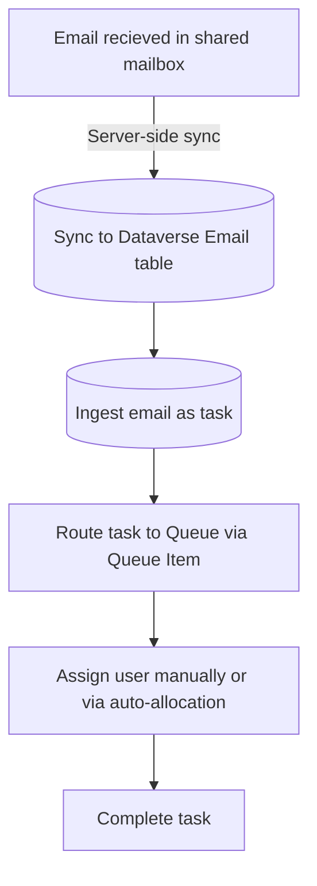
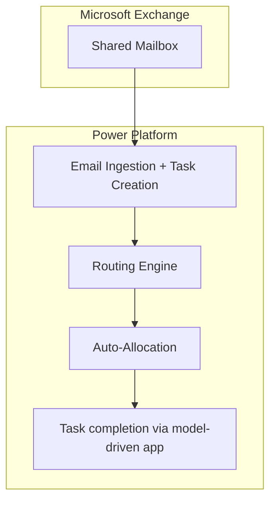
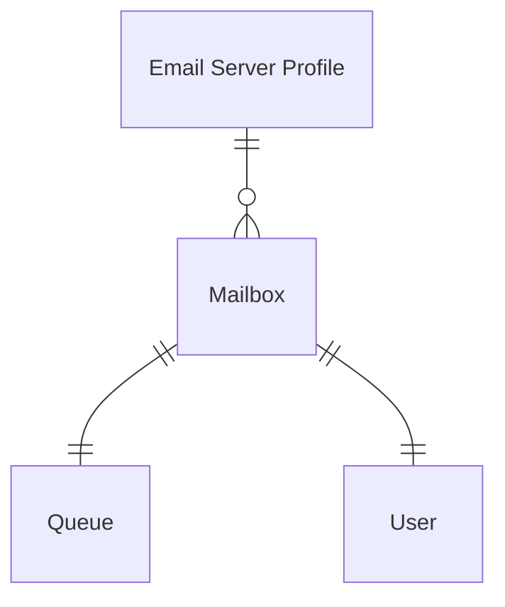

# High‑Level Design (HLD)
This document provides a high-level architectural overview of the base task management solution, including it's purpose and core components.

>This HLD is intended for architects, administrators, developers and delivery teams working with or supporting the solution for use on other task management solutions.

## Project Background

### Purpose 

The base task management solution serves as the starting foundations for all future task management solutions, including MEBC and Tax email management.

The solution works without any additional development but is expected to be deployed as unmanaged to a new environment, before being adapted to each email & task management project that comes through the low code platform team.

Many teams across HMCTS experience large numbers of emails into shared mailboxes, which often become difficult to manage and assign. The task management base solution connects to the shared mailbox via server-side synchronisation, and processes all incoming emails into actionable tasks, assigned to the correct team through routing rules.

### References

| Title                                                       | Description             | Link                                            |
|-------------------------------------------------------------|-------------------------|-------------------------------------------------|
| CNBC epic | Original JIRA epic used to develop the base solution   | https://tools.hmcts.net/jira/browse/DTSRPA-601 |
| Power Platform development environment | Current environment for making changes | https://make.powerapps.com/environments/c48b3376-9d1b-efeb-9da6-42c9adad53a4      |

## Business Architecture

### Business Process
As an example, the Civil National Business Centre (CNBC) team have 23 separate email inboxes, which recieves hundreds of emails each day to support the early administrative and processing stages of county court claims.

### Problem Statement
Continuing with the CNBC example, the volume of emails arriving across the 23 mailboxes became difficult to manage, with users running into frequent API issues and Outlook crashes.

### Requirements
The requirements below have been written up retrospectively based on the current implementation of CNBC, as a guide for other task & email management solutions.

#### Functional
|ID |Title |Description |
|-|-|-|
|TBC| TBC|TBC|

#### Non-functional
- **TBC** - TBC

### RAID Log
#### Risks
| ID  | Risk                          | Description                                                                                                 |
|-----|--------------------------------|-------------------------------------------------------------------------------------------------------------|
| R1  | Dataverse Throttling          | High‑volume of incoming emails may hinder Power Automate & Dataverse performance. Since CNBC, several performance changes have been made to reduce billable actions. |
| R2  | Misconfigured Routing Rules | Incorrect or overly broad routing rules may result in tasks being assigned an incorrect queue & user. The option to re-run routing rules for multiple queue items was added to the solution, especially beneficial in early hypercare periods.                        |

#### Assumptions

| ID  | Assumption                          | Description                                                                                      |
|-----|--------------------------------------|--------------------------------------------------------------------------------------------------|
| A1  | Project specific discovery & requirements         | Each implementation of the task management base should still conduct thorough and fair discovery, including requirements gathering, before aligning with the base solution.   |

#### Issues

| ID  | Issue                        | Description                                                                                               |
|-----|------------------------------|-----------------------------------------------------------------------------------------------------------|
| I1  | None documented     |   |

#### Decisions

| ID  | Decision                       | Description                                                                                                      |
|-----|--------------------------------|-------------------------------------------------------------------------------------------------------------------------|
| D1  | Deploy base solution as unmanaged and customise | The original approach was to host the base solution in a development environment and deploy to project-specific development environments as a managed solution, with project-specific customisations applied in a separate solution. This quickly became cumbersome, with each development requiring a change to the base solution, so the decision was taken to deploy the base solution as unmanaged without any dependencies.   |

## Data Architecture
The data model consists of fourteen core entities, a mix of standard and custom Dataverse tables, based on the structure of tasks and queues.

### Data Model

### Data Glossary

| Entity            | Description |
|--------------------------|-------------|
| **Activity**       | Relate Notes to Tasks |
| **Attachment**       | Store files against email records.  |
| **Email**       | Ingested emails from shared mailboxes using server-side synchronisation |
| **Keyword**       | Capture keywords to search against for each routing rule |
| **Queue**       | A list of records that require action   |
| **Queue Item**       | A specific item in a queue, such as a task or email |
| **Role Marker - Standard User**       | Empty table used in Ribbon Workbench to customise command bar |
| **Routing Log**       | Record all successful attempts at routing tasks to queues |
| **Routing Rules**       | Criteria to evaluate tasks against before assigning to a queue |
| **Task**       | Generic activity representing an email (or multiple) to be actioned  |
| **Task Event**       | Audit log of key actions taken against a task |
| **User**       | Default system user table |
| **User Status**       | Store user online/offline status for auto-allocation |
| **Web Form Configuration**       | JSON records containing question/answer config for MoJ Web Forms  |

### Data Flow

## Solution Design
The ERM solution is built using Microsoft Power Platform and automates the scanning, evaluation, and deletion of emails within shared mailboxes. Administrators (within the Low Code Platform Team) configure mailboxes and retention rules through a model‑driven app, while Power Automate flows execute scheduled, automated processes against Microsoft's Graph API.

The base task management solution is built using Microsoft Power Platform and connects to Microsoft Exchange using server-side synchronisation, to ingest emails into the application. Users automatically pick up newly assigned tasks and action them outside of the app, marking them as complete once finished. The solution makes use of many out-of-the-box features include queues/queue items and task management.

### High-Level Architecture

 Scheduled cloud flows use this configuration to retrieve mailbox details, query shared mailboxes via Microsoft Graph, evaluate emails against retention rules, delete those that meet the criteria, and record all actions back into Dataverse.

The model-driven app provides case workers with an easy interface to view and manage their assigned tasks whilst administrators can configure routing rules and re-route items to the correct team or queue.

Classic workflows are leveraged to ensure quality data hygiene whilst Power Automate flows carry out the bulk of processing from ingestion and routing, to auto-allocation and data capacity maintenance.

### Solution Components
Below are the key power platform components, excluding those used in governance and configuration (such as environment variables, connection references).

- **Model-Driven App** - Email and task handling, queue maintenance and routing rule development
- **AI Model** - Adoption of a custom prompt to extract hearing dates from the incoming email body text
- **Canvas App** - JSON query builder is nested on the routing rule form, to build JSON queries for routing MoJ form tasks
- **Cloud Flows** - Task creation, routing, auto-allocation and data hygiene tasks
- **Component library** - Managing Power Fx command bar buttons applied to tasks, queue items and routing rules
- **Pages** - Custom pages used to provide additional functionality for auto-allocation and routing tasks to queues within the model-driven app
- **Processes** - Supporting and managing data hygiene in real-time
- **Dataverse Tables** - Store Email + Task data, routing rule metadata, task-queue assignments and user status data for auto-allocation

### Processes

#### Email Ingestion
A vital part of the solution is configuration of the email server profile to pick up emails that arrive into a shared mailbox being used by caseworkers and team members. This ingestion uses the [server-side synchronisation](https://learn.microsoft.com/en-us/power-platform/admin/server-side-synchronization) feature which processes received emails and creates them in the 'Email' Dataverse table.

Similarly, if a user sends an email from within the model-driven app, then a record is added to the email table, before it is sent via Microsoft Exchange.

The child flow queries emails that meet the retention criteria, batches them into groups of 20, and repeatedly deletes each batch using the Graph API while logging any errors, until all qualifying emails are removed and the final deletion count is written to Dataverse.

The classic workflow `Set Default Email Subject/Body` automatically sets the body or subject of an incoming email to "(None)" if either field is blank upon receipt. This ensures there is always a string for future automations to use and avoid user confusion.

#### Task Creation

#### Task Routing

#### Auto-Allocation

### Integrations
#### Microsoft Exchange

### Security
#### Service Accounts
For any environment the solution is hosted within, an Entra ID service account must be used to manage the solution, including ownership of any connection references.

#### Shared Mailbox

#### Dataverse Roles
Currently, no custom security roles have been created for this solution. The expectation is the app will be used by the Low Code Platform Team to manage mailbox retention policies, without granting access to end-users. Any user wishing to access the solution should do so via a default security role, such as System Administrator.