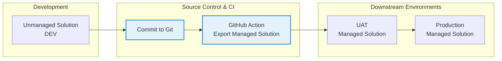

# Operational Runbook
The runbook document provides operational guidance for deploying, configuring, and supporting the ERM tool, outlining the steps and controls required to safely manage environments, onboard new mailboxes, and maintain the solution throughout its lifecycle.

## Solutions

## Deployment
Only one solution is required (Email Retention Management) which can deployed as managed to any required environment. There are no dependencies and no additional environment settings that need to be configured.

This diagram illustrates the end‑to‑end ALM flow for the Power Platform solution, showing how changes are developed and maintained as an unmanaged solution in the DEV environment before being committed to source control. Each commit to the Git repository triggers a GitHub Action responsible for importing an unmanaged solution artifact, which is then deployed consistently (as managed) to downstream environments such as UAT and Production.

### Deployment Steps

## Environment Configuration

### Environments

|Name|Type|Purpose|Solution Type|URL|
|-|-|-|-|-|
|HMCTS-ALL-DEV|Sandbox|Development|Unmanaged|https://hmcts-dev.crm11.dynamics.com|
|UAT|
|PROD|

### Environment Variables
No Environment Variables are currently in use in the ERM solution.

|Name|Description|DEV|UAT|PROD|Notes
|-|-|-|-|-|-|
|Hard Delete Emails \| ERM|Defines whether emails are hard-deleted (permanently deleted) or soft-deleted (recoverable). | No | No | Yes |

### Connection References

|Name|Connector|Purpose|DEV|UAT|PROD|Notes|
|-|-|-|-|-|-|-|
|Dataverse \| ERM|Microsoft Dataverse| Authenticate Cloud Flows to Dataverse|SVC Account|SVC Account|SVC Account||
|HTTP with Microsoft entra ID (preauthorized) \| ERM |HTTP with Microsoft entra ID (preauthorized)|Connect to Microsoft Graph from Cloud Flows| https://graph.microsoft.com| https://graph.microsoft.com|https://graph.microsoft.com| Both Base Resource URL and Microsoft Entra ID Resource URI should be set to https://graph.microsoft.com

## Operational Support
Support teams should regularly review the retention rule log and flow execution times to validate success deletions and confirm expected processing volumes.

