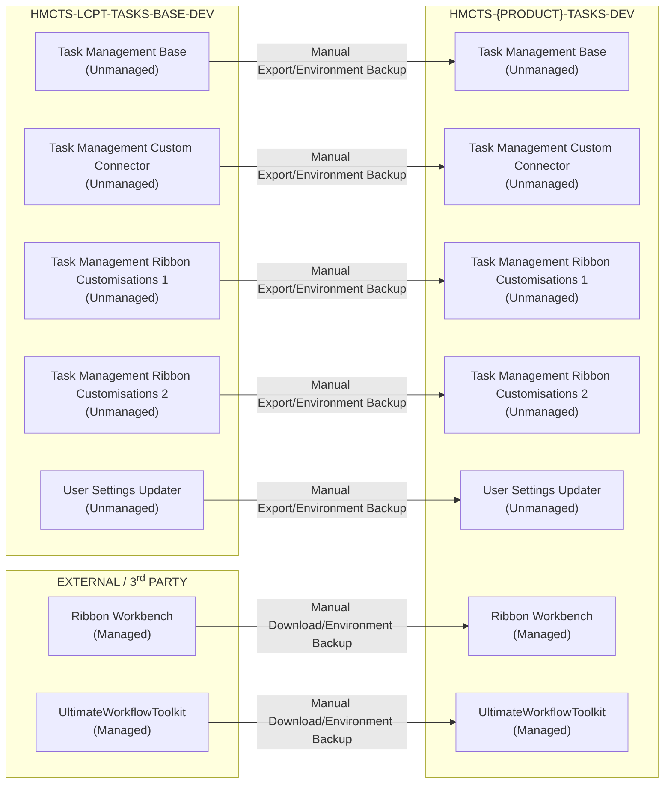

# Operational Runbook
The runbook document provides operational guidance for deploying, configuring, and supporting the Task Management base solution, outlining the steps and controls required to deploy the solution downstream, so that it can be customised for new products in the low code platform team.

## Solutions

The project is formed of 6 different Power Platform solutions, all 6 should be imported into the starting development environment before customising the project.

> **Note:** Ribbon Workbench only accepts solutions containing a maximum of 5 entities with no other component types in that solution.

|Name|Purpose|
|-|-|
|Task Management Base|Main store of all core customisations including tables, apps and automations.|
|Task Management Custom Connector| Contains separate, re-usable custom connectors which should be deployed before the base solution.
|Task Management Ribbon Customisations 1|Contains custom command buttons and hide rules for the first 5 entities, edited in Ribbon Workbench.
|Task Management Ribbon Customisations 2|Contains the 6th, and final entity, customised in Ribbon Workbench with custom commands and hide rules.| 
|Task Management Global Command Bar|Holds the Application Ribbon component used to customise the global command bar, separate from entity-based command bars.
|[Ribbon Workbench](https://www.develop1.net/public/rwb/ribbonworkbench.aspx) (Managed)| 3rd party solution used to administer command bars and application ribbons. Please note Ribbon Workbench is also accessable via XRMToolBox, without needing to install the solution.
|[UltimateWorkflowToolkit](https://github.com/AndrewButenko/UltimateWorkflowToolkit) (Managed)| 3rd party solution used in classic workflows to calculate task due date, based on Queue SLA's.
|User Settings Updater (Optional)| 2 utility Power Automate flows to manage user settings in the environment, such as date formatting and language. This can also be achieved using the [User Settings Utility](https://www.xrmtoolbox.com/plugins/MsCrmTools.UserSettingsUtility/) in XRMToolBox.

## Deployment
This section covers the dependencies and steps to import the project into a new development environment.

### Dependencies

#### Dynamics 365 Apps
The main base solution has several dependencies on existing Dynamics 365 products. When creating a new developer environment to customise the solution, it is recommended to check the setting `Install D365 apps`. Alternatively, developers can now install any required dependencies through the solution import wizard.

#### Ultimate Workflow Toolkit
The Classic Workflow `Queue Item Sync (Queue)` requires the Ultimate Workflow Toolkit solution, which can be downloaded from the [GitHub Repo](https://github.com/AndrewButenko/UltimateWorkflowToolkit/releases), managed by the creator Andrew butenko.

This solution contains a custom action which allows the calculation of task due date, inside the classic workflow, based on the task creation date + assigned Queue SLA (days).

#### DLP Policies
By default, many MoJ environments block the use of custom connectors and the `HTTP with Entra ID` connector, both of which are required to use the solution. Ensure the accepting environment has a DLP appropriate for the main base solution. A list of connection references can be found below.

#### Dedicated Shared Mailbox
As part of Microsoft's server-side synchronisation feature, only 1 Power Platform environment can be linked to a shared email mailbox at any given time. This means the new development environment must have it's own shared mailbox in order to test and develop features in the development environment. Mailboxes cannot be shared between 2 or more environments.

### Environments
|Name|Type|Purpose|URL|
|-|-|-|-|
|HMCTS-LCPT-TASKS-BASE-DEV|Sandbox|Development|https://hmcts-lcpt-tasks-base-dev.crm11.dynamics.com|

### Environment Variables
All environment variables are included in the core solution `Task Management Base`.

|Name|Description|DEV Value|Notes
|-|-|-|-|
|Auto Allocation Delay Length Before Unassign|For auto allocation, how many minutes should the user be offline for before any tasks get auto unassigned from them. | 2 |  |
|Auto Allocation Related Tasks|Tasks with the same Case Number can be auto allocated.| Yes |  |
|Case Number Pattern|Stores the regular expression (regex) pattern used to identify and extract case reference numbers from email subject lines and message bodies.| \b[a-zA-Z0-9]\d[a-zA-Z0-9]{3}[a-zA-Z0-9]{3}\b | This will always differ depending on the target solution. |
|Email Loop Detection Destination Queue|When an email loop is detected, which queue should the tasks be routed to. This should be the Queue ID.| 04a82b7d-f297-f011-b41b-6045bdd14a24 |  |
|Email Loop Detection Time Span|The number of minutes that should be considered for detection. This number should be negative.| -5 | |
|Email Loop Number Required|The number of emails required in the Time Span to count as an email loop.| 5 | |
|Email Total Attachment Size Limit (Bytes)|The maximum cumulative size (in bytes) allowed for all attachments combined on a single outgoing email. | 5242880 |  |
|Hearing Date Detection|Is automatic hearing date detection is enabled. | No | This is yet to be enabled in any production environment. |
|Outbound Email Queue Settings| JSON configuration of the default Queue to send emails from. | {  "outbound": {    "QueueName": "CNBC Incoming 2",    "QueueId": "e4c5ff1e-54b1-ef11-b8e9-6045bdfc394d"  },  "accessibility": {    "QueueName": "Accessibility Emails",    "QueueId": "f2b8127d-b7e6-ef11-9342-7c1e5203c47f"  }} | This can only be set once the solution has been imported and both queues have been created in the environment. Edit via default solution. |

### Connection References
Listed below are the connection references used within the base solution, note that the `HTTP with Microsoft Entra ID` connection should be based on the environment's URL.

|Name|Purpose|DEV Value|
|-|-|-|
|Content Conversion \| TSK|Convert HTML to plain text on task creation|Developer personal connection|
|CSV Parser \| TSK|Parse CSV to JSON for Web Form ingestion|Developer personal connection|
|HTTP with Microsoft Entra ID (preauthorised) \| TSK|Carry out bulk updates and Upserts to Dataverse |Dataverse environment URL (https://hmcts-lcpt-tasks-base-dev.crm11.dynamics.com)|
|Microsoft Dataverse \| TSK|General data management|Developer personal connection|
|RegEx Engine \| TSK|Extract GUIDs and case numbers|Developer personal connection|
|Task Apply Rules \| TSK|Process tasks against routing rules to route to queues|Developer personal connection|
| Web Form JSON Mapper \| TSK|Map incoming web form data against web form config to produce an array of questions & answers|Developer personal connection|

### Deployment Steps

To deploy the base product to a new development environment for configuration, users can either backup the base environment into a new environment with the product name, or manually import each solution as shown below.

Ensure that all dependencies are resolved before importing, particularly with D365 Apps and the `UltimateWorkFlowToolkit` solution.

If importing each solution individually, then it is advised to import in the following order:

1. UltimateWorkFlowToolkit
2. Task Management Custom Connector
3. Task Management Base
4. Task Management Ribbon Customisations 1
5. Task Management Ribbon Customisations 2
6. Task Management Global Command Bar
7. User Settings Updater (Optional)
8. Ribbon Workbench (Optional)

During solution import, set any connection references to a personal developer account, or a service account if available (except `HTTP With Entra ID`).

Most environment variables can be left as default, with the exception of `Outbound Email Queue Settings` and `Email Loop Detection Destination Queue` which can only be set once the initial queues have been created.

After successful solution import, be sure to click `Publish Customisations` against each solution, particularly for command bar customisations.

## Configuration

## Operational Support
N/A

