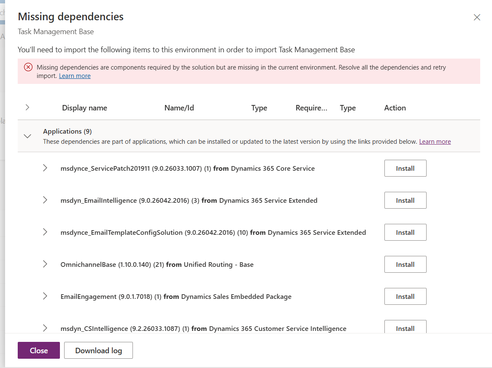
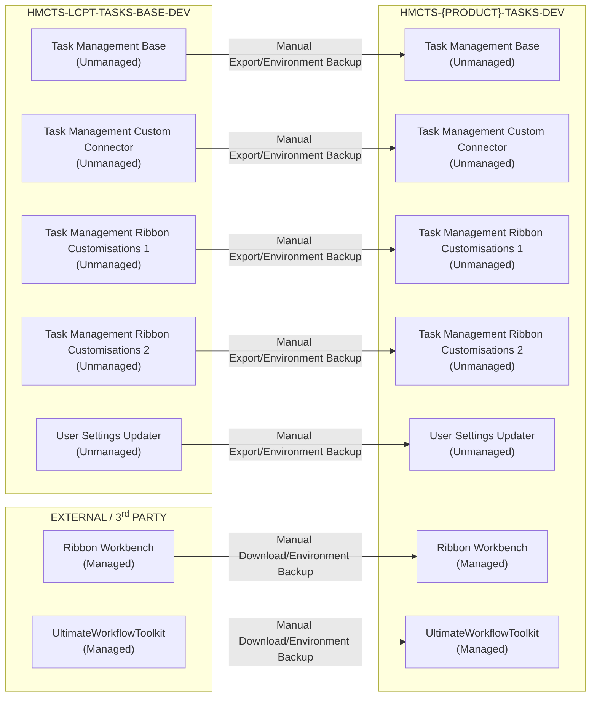
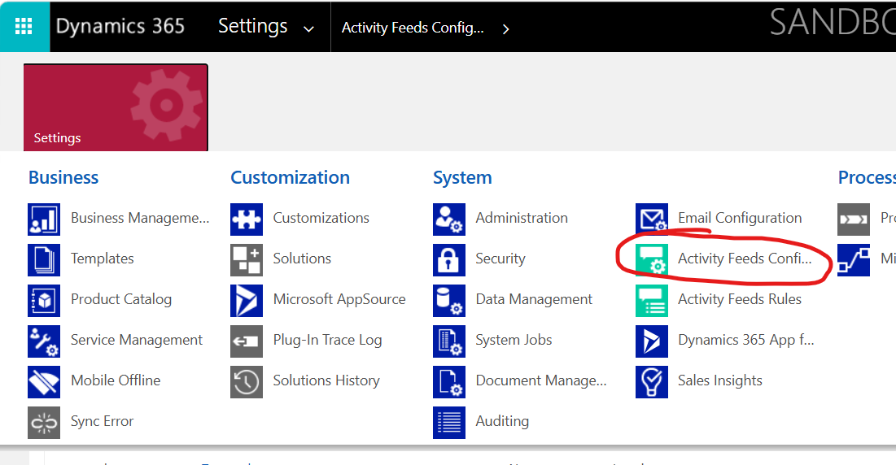
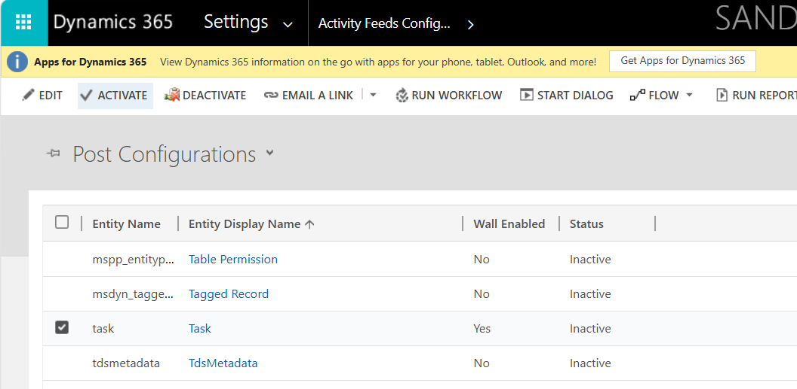
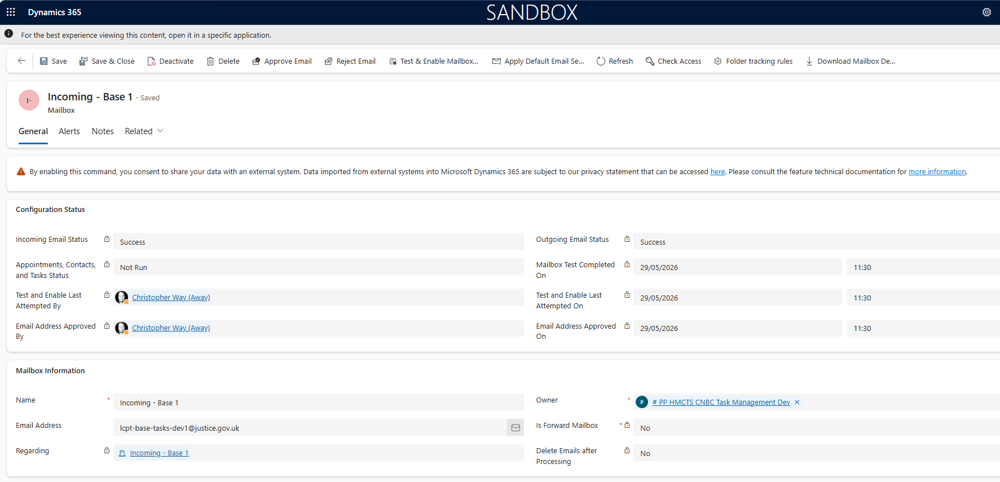

# Operational Runbook
The runbook provides operational guidance for deploying, configuring, and supporting the Task Management base solution. It defines the steps and controls required to deploy the solution to downstream environments, enabling it to be customised for new products within the Low Code Platform Team.

## Solutions
The project consists of eight Power Platform solutions. All solutions must be imported into the initial development environment before any customisation begins.

> **Note:** Ribbon Workbench only supports solutions that contain a maximum of five entities and no other component types.

|Name|Purpose|
|-|-|
|Task Management Base|Primary solution containing all core customisations, including tables, apps, and automations.|
|Task Management Custom Connector| Contains reusable custom connectors. This solution must be deployed before the base solution.
|Task Management Ribbon Customisations 1|Includes custom command buttons and hide rules for the first five entities, managed in Ribbon Workbench.
|Task Management Ribbon Customisations 2|Contains custom command buttons and hide rules for the sixth and final entity, configured in Ribbon Workbench.| 
|Task Management Global Command Bar|Stores the Application Ribbon component used to customise the global command bar, separate from entity-level command bars.
|[Ribbon Workbench](https://www.develop1.net/public/rwb/ribbonworkbench.aspx) (Managed)| Third-party solution used to configure command bars and application ribbons. It can also be accessed via XRMToolBox without installing the solution.
|[UltimateWorkflowToolkit](https://github.com/AndrewButenko/UltimateWorkflowToolkit) (Managed)| Third-party solution used within classic workflows to calculate task due dates based on queue SLAs.
|User Settings Updater (Optional)| Provides two utility Power Automate flows for managing user settings (e.g. date formatting and language). Alternatively, this can be managed using the [User Settings Utility](https://www.xrmtoolbox.com/plugins/MsCrmTools.UserSettingsUtility/) in XRMToolBox.

## Deployment
This section outlines the dependencies and required steps for importing the project into a new development environment.

### Dependencies
#### Dynamics 365 Apps
The base solution has several dependencies on existing Dynamics 365 applications. When creating a new development environment for customisation, it is recommended to enable the `Install D365 apps` setting.
Alternatively, required dependencies can be installed during the solution import process using the solution import wizard.



#### Ultimate Workflow Toolkit
The `Queue Item Sync (Queue)` classic workflow depends on the Ultimate Workflow Toolkit solution. This can be downloaded from the [GitHub Repo](https://github.com/AndrewButenko/UltimateWorkflowToolkit/releases), managed by its creator, Andrew Butenko.

The solution provides a custom action used within the workflow to calculate the task due date. This is determined based on the task creation date combined with the assigned queue SLA (in days).

#### DLP Policies
By default, many MoJ environments restrict the use of custom connectors and the `HTTP with Entra ID` connector, both of which are required by this solution. Ensure that the target environment has an appropriate DLP policy configured to support the base solution. A list of required connection references is provided below.

#### Dedicated Shared Mailbox
Due to Microsoft's server-side synchronisation limitations, a shared mailbox can only be linked to a single Power Platform environment at a time. As a result, each development environment must have its own dedicated shared mailbox for testing and development purposes. Shared mailboxes cannot be used across multiple environments.

### Environments
|Name|Type|Purpose|URL|
|-|-|-|-|
|HMCTS-LCPT-TASKS-BASE-DEV|Sandbox|Development|https://hmcts-lcpt-tasks-base-dev.crm11.dynamics.com|

### Environment Variables
All environment variables are included in the core solution `Task Management Base`.

|Name|Description|DEV Value|Notes
|-|-|-|-|
|Auto Allocation Delay Length Before Unassign|For auto allocation, how many minutes should the user be offline for before any tasks get auto unassigned from them. | 2 |  |
|Auto Allocation Related Tasks|Tasks with the same Case Number can be auto allocated.| Yes |  |
|Case Number Pattern|Stores the regular expression (regex) pattern used to identify and extract case reference numbers from email subject lines and message bodies.| \b[a-zA-Z0-9]\d[a-zA-Z0-9]{3}[a-zA-Z0-9]{3}\b | This will differ depending on the target solution and case number formatting. |
|Email Loop Detection Destination Queue|When an email loop is detected, which queue should the tasks be routed to. This should be the Queue ID.| 04a82b7d-f297-f011-b41b-6045bdd14a24 |  |
|Email Loop Detection Time Span|The number of minutes that should be considered for detection. This number should be negative.| -5 | |
|Email Loop Number Required|The number of emails required in the Time Span to count as an email loop.| 5 | |
|Email Total Attachment Size Limit (Bytes)|The maximum cumulative size (in bytes) allowed for all attachments combined on a single outgoing email. | 5242880 |  |
|Hearing Date Detection|Is automatic hearing date detection is enabled. | No | This is yet to be enabled in any production environment. |
|Outbound Email Queue Settings| JSON configuration of the default Queue to send emails from. |``` {  "outbound": {    "QueueName": "CNBC Incoming 2",    "QueueId": "e4c5ff1e-54b1-ef11-b8e9-6045bdfc394d"  },  "accessibility": {    "QueueName": "Accessibility Emails",    "QueueId": "f2b8127d-b7e6-ef11-9342-7c1e5203c47f"  }} ```| This can only be set once the solution has been imported and both queues have been created in the environment. Edit via default solution. |

### Connection References
The following section lists the connection references used within the base solution. Note that the `HTTP with Microsoft Entra ID` connection must be configured using the target environment's URL.

|Name|Purpose|DEV Value|
|-|-|-|
|Content Conversion \| TSK|Convert HTML to plain text on task creation|Developer personal connection|
|CSV Parser \| TSK|Parse CSV to JSON for Web Form ingestion|Developer personal connection|
|HTTP with Microsoft Entra ID (preauthorised) \| TSK|Carry out bulk updates and Upserts to Dataverse |Dataverse environment URL (https://hmcts-lcpt-tasks-base-dev.crm11.dynamics.com)|
|Microsoft Dataverse \| TSK|General data management|Developer personal connection|
|RegEx Engine \| TSK|Extract GUIDs and case numbers|Developer personal connection|
|Task Apply Rules \| TSK|Process tasks against routing rules to route to queues|Developer personal connection|
| Web Form JSON Mapper \| TSK|Map incoming web form data against web form config to produce an array of questions & answers|Developer personal connection|

### Deployment Steps
To deploy the base solution to a new development environment for configuration, you can either restore the base environment into a new environment (named for the target product), or manually import each solution as outlined below.


Ensure all dependencies are resolved prior to import, particularly Dynamics 365 applications and the `UltimateWorkflowToolkit` solution.

If importing solutions individually, it is recommended to follow the sequence outlined below:

1. UltimateWorkFlowToolkit
2. Task Management Custom Connector
3. Task Management Base
4. Task Management Ribbon Customisations 1
5. Task Management Ribbon Customisations 2
6. Task Management Global Command Bar
7. User Settings Updater (Optional)
8. Ribbon Workbench (Optional)

During solution import, configure all connection references to authenticate using a personal developer account, or a service account if available (excluding `HTTP with Entra ID`).

Most environment variables can remain at their default values. The exceptions are `Outbound Email Queue Settings` and `Email Loop Detection Destination Queue`, which can only be configured after the initial queues have been created.

After successfully importing the solutions, ensure you publish customisations for each solution, with particular attention to command bar customisations.

## Configuration
The following steps are required to complete the setup of the base solution in a new environment.

### Activity Feeds
Several Power Automate flows implement a try-catch-finally pattern. Within the finally scope, a success or error message is recorded against the relevant task record to help correlate flow execution results with individual tasks. This is achieved by creating an *auto-post* record in the Post table.

By default, post records cannot be associated with custom or standard tables without updating the Activity Feeds configuration in each Dataverse environment. If this configuration is not applied, an error will occur when attempting to enable the Power Automate flows:

**[Insert image of error in PROD here]**

To update the Post Configuration for the task table, navigate to the legacy settings menu in Power Platform:

Admin Centre → Environment → Settings → Resources → All Legacy Settings

Under the 'System' heading, select Activity Feeds Configuration.



Locate and select the relevant entity (for example, Task) and click 'Activate' in the command bar.



Once activated, the Power Automate flows that create auto-posts against the task table can be enabled within the base solution.

### Shared Mailboxes

To receive emails within the Task Management application, at least one shared mailbox must be configured in the Power Platform environment for server-side synchronisation.

Navigate to:

Power Platform Admin Centre → Manage → Select the appropriate environment → Settings → Email → Mailboxes

From here, environment administrators can create a new mailbox. The mailbox must then be approved by a Power Platform Administrator (for example, within MoJ) before it can be used.



A successful configuration should show both `Incoming Email Status` and `Outgoing Email Status` as Success. Additionally, both `Incoming Email` and `Outgoing Email` must be set to Server-Side Synchronisation.

### Queues
After configuring the shared mailbox, Power Platform automatically creates a corresponding queue to receive incoming emails.

Typically, the Task Management base solution should include one or more dedicated queues to support the following scenarios:

- Receiving emails (automatically created with the mailbox)
- Sending outbound emails (often using the same queue as above)
- Sending outbound emails for accessibility-related scenarios
- Handling tasks with no matching routing rules during assignment
- Managing email loop messages (e.g. non-deliverable reports, spam, or bounce-backs)

> **Note:** It is recommended to create queues **after** importing the solution. This ensures that column defaults and required fields (such as `Exclude From Routing` and `SLA Days`) are correctly applied to all queues.

### Environment Variables
Once all queues have been setup, administrators can update 2 of the environment variables to finish configuration of the solution:

|Environment Variable|Format|
|-|-|
|Outbound Email Queue Settings|``` {  "outbound": {    "QueueName": "CNBC Incoming 2",    "QueueId": "e4c5ff1e-54b1-ef11-b8e9-6045bdfc394d"  },  "accessibility": {    "QueueName": "Accessibility Emails",    "QueueId": "f2b8127d-b7e6-ef11-9342-7c1e5203c47f"  }} ```|
|Email Loop Detection Destination Queue|04a82b7d-f297-f011-b41b-6045bdd14a24|

### Common Smoke Tests
The following tests are recommended after migrating the solution to a new environment:
- **App Views:** Verify that all views for `Queue Items` and `Tasks` are consistent. Importing an unmanaged model-driven app can sometimes introduce unintended or duplicate views.
- **Command Bars:** Validate key command bars, particularly the Task Home Grid, Task Form, and Queue Item Home Grid (when a record is selected).
- **Email Ingestion:** With all flows enabled, send a test email to the shared mailbox. The email should be ingested as a task, assigned to a queue, and given a due date based on the queue’s SLA.
- **Create New Email:** Confirm the presence of the + New Email option in the global application ribbon. This should open a new email form, with the `From` field defaulting to the configured outbound email environment variable.

### Entra ID Groups
Below is an example of how 4 Entra ID access groups should be created with the appropriate Dataverse roles assigned to them.
| Team                | Role Rules Administrator | Role Auto Allocation Leader | Role Auto Allocation User | Role Service Leader | Role Standard User | Role Team Leader |
|--------------------|--------------------------|------------------------------|----------------------------|---------------------|--------------------|------------------|
| Rule Administrators| ✅                        |                              |                            |                     |                    |                  |
| Service Leaders    |                          | ✅                            | ✅                          | ✅                   |                    |                  |
| Standard Users     |                          |                              | ✅                          |                     | ✅                  |                  |
| Team Leaders       |                          | ✅                            |                            |                     |                    | ✅                |