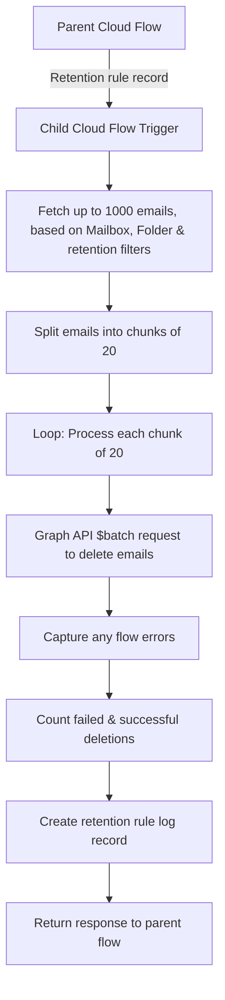

# Get Emails And Delete | Child Flow | ERM

This child cloud flow is triggered by a [parent flow](01-trigger-mailbox-email-retention.md) upon receipt of a retention rule record. Its purpose is to evaluate the criteria defined in the retention rule against a specified mailbox using the Microsoft Graph API. Any emails that meet the deletion criteria are deleted. Permanent deletion (when the `Hard Delete Emails | ERM` environment variable is set to Yes) is used to ensure mailbox storage capacity is effectively maintained and reclaimed.

## Inputs & Outputs

**Inputs:** The cloud flow receives a full retention rule record, which must include the mailbox UPN (email), folder, scope and retention duration at a minimum.

**Outputs:** The `Respond to a Power App or flow` action returns the log details to the parent flow as a placeholder, no actions are taken when this data is returned.

## Flow Logic

The diagram illustrates how the child cloud flow processes a retention rule received from a parent flow by retrieving eligible emails, batching them for deletion via the Microsoft Graph API, and tracking both successful and failed deletions. Once processing is complete, the flow records the outcome in a retention rule log and returns a summary response to the parent flow.


## Error Handling

### Try-Catch-Finally
The flow follows a standard try–catch–finally pattern to execute core actions, capture any general flow-level errors (excluding individual email deletion failures), and write relevant error details back to the retention rule table.

Because the Microsoft Graph `$batch` request can return an overall success response even when individual deletions fail (for example, 19 successes and 1 failure), additional logic has been implemented to identify and capture these per‑item failures. This ensures individual deletion errors are accurately tracked and reported.

### Failed Deletions
The finally scope is used to perform consolidated post‑processing regardless of whether the main execution encountered errors. Within this scope, the flow evaluates the accumulated success and failure counts from both the batch execution and the individual item‑level checks, ensuring all deletion outcomes are included. These values are used to populate a structured log variable (compose action), along with any captured error details in JSON format. 

The flow then creates a new retention rule log record that records the total number of successful and failed deletions, together with the associated error payload. This approach guarantees that a complete, auditable summary of the retention run is written back to the retention rule table and returned to the parent flow, even when partial failures or unexpected errors occur.

## Testing 

Testing can be initiated by manually running the parent flow. Due to Power Automate limitations, users cannot re-run a previously triggered child flow.

Test case coverage can be found against the originating user stories in JIRA. See the [High‑Level Design](../01-high-level-design.md) for User Story links.

## Architecture Decisions
### Top 1000 Emails
The initial Microsoft Graph query limits results to 1,000 emails because this is the maximum number of items that can be returned in a single request before paging is required. While Graph supports pagination through the @odata.nextLink value, intentionally capping the query at the first 1,000 items ensures predictable execution and avoids the complexity and overhead of handling multiple paged requests within a single flow run. 

This approach helps prevent long‑running executions, reduces the risk of throttling, and keeps resource usage within Power Automate limits. If more than 1,000 items qualify for deletion, subsequent runs of the flow can safely process the remaining items.

### Batch Size Of 20 Emails
The batch size of 20 in the $batch delete request is constrained by Microsoft Graph API limits, which allow a maximum of 20 individual operations per batch. Staying within this boundary ensures the flow remains compliant with the API specification while maximizing efficiency by reducing the number of HTTP calls required. 

### Hard Vs Soft Delete Emails
The flow now supports both hard and soft deletion of emails, controlled by an environment variable `Hard Delete Emails | ERM`. When the variable is set to `Yes` to enable hard deletion, the flow uses the POST `/microsoft.graph.permanentDelete` endpoint to ensure that emails are irreversibly removed from the mailbox and do not remain in recoverable locations such as Deleted Items or the Recoverable Items folder. 

When the variable is set to `No` to disable hard deletion, the flow performs a standard DELETE operation, resulting in a soft delete where items may still be recoverable and continue to consume storage. This configurable approach provides flexibility while ensuring that, when required, permanentDelete can be used to immediately free storage capacity and fully enforce retention policies, supporting both operational needs and compliance-driven data removal.

## Key Expressions

### Fetch Emails URL
The Graph API request URL is dynamically constructed within the `HTTP With Entra ID` action using values from the incoming retention rule record. It targets a specific user mailbox based on the provided email address and queries a designated mail folder derived from the formatted text value of a Dataverse choice. The request retrieves up to 1,000 messages and selects only the message id field to minimize payload size.

A retention filter is applied by calculating a cutoff date from the configured retention period (in days) and selecting messages with a lastModifiedDateTime earlier than this threshold. An optional scope condition is also appended to the filter: when the scope value equals 2, the query is further restricted to messages tagged with the “Tracked to Dynamics 365” category. This conditional filtering ensures that only emails matching both retention and scope criteria are returned for evaluation and deletion.
```
https://graph.microsoft.com/v1.0/users/

@{json(triggerBody()?['text'])['mailbox.erm_email']}

/mailFolders/

@{json(triggerBody()?['text'])['erm_folder@OData.Community.Display.V1.FormattedValue']}

/messages?$top=1000&$select=id&$filter=lastModifiedDateTime lt 

@{addDays(
    utcNow(),
    mul(
        int(json(triggerBody()?['text'])['erm_retentionperioddays']),
        -1
    )
)}

@{if(
    equals(
        json(triggerBody()?['text'])?['erm_scope'],
        2
    ),
    ' and categories/any(c:c eq ''Tracked to Dynamics 365'')',
    ''
)
}
```

### Graph Deletion URL

The deletion endpoint is dynamically constructed within a `Select` action to prepare individual Microsoft Graph requests for batch processing. The URL combines the target mailbox email address with each message's unique identifier, resulting in a fully qualified endpoint for that message. If the environment variable `Hard Delete Emails | ERM` is set to Yes, the request appends the `/microsoft.graph.permanentDelete` action to ensure the email is permanently removed from the mailbox rather than soft‑deleted. 
```
/users/

@{json(triggerBody()?['text'])['mailbox.erm_email']}

/messages/

@{item()?['id']}

@{if(parameters('Hard Delete Emails | ERM (erm_HardDeleteEmailsERM)'), '/microsoft.graph.permanentDelete', '')}
```

### Compose Batch Responses
To minimise additional actions and avoid unnecessary API calls, a single union expression is used to consolidate the outputs from all batch requests (maximum of 50, based on top 1000 and chunk size of 20) into one unified array. This aggregated result allows the flow to evaluate all batch responses collectively within the Finally scope, simplifying downstream processing such as success/failure counting and error handling.

```
union(
    coalesce(body('Invoke_an_HTTP_request_|_Batch_Request_Via_Microsoft_Graph')?[0]?['responses'], json('[]')),
    coalesce(body('Invoke_an_HTTP_request_|_Batch_Request_Via_Microsoft_Graph')?[1]?['responses'], json('[]')),
    coalesce(body('Invoke_an_HTTP_request_|_Batch_Request_Via_Microsoft_Graph')?[2]?['responses'], json('[]')),
...
    coalesce(body('Invoke_an_HTTP_request_|_Batch_Request_Via_Microsoft_Graph')?[49]?['responses'], json('[]')),
    coalesce(body('Invoke_an_HTTP_request_|_Batch_Request_Via_Microsoft_Graph')?[50]?['responses'], json('[]'))
)
```