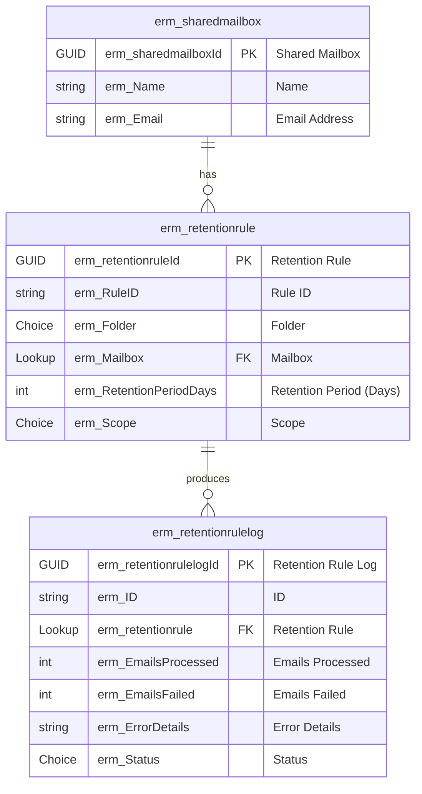

# Data Model
This document describes the Dataverse data model underpinning the Email Retention Management (ERM) solution. The data model supports the ERM solution's goal of automating governance and lifecycle management for shared mailboxes by enabling retention rule enforcement and controlled email removal.

## Entity Relationship Diagram

## Data Glossary

| Entity            | Description |
|--------------------------|-------------|
| **Shared Mailbox**       | Represents a shared mailbox configured for retention management, including its display name and email address. |
| **Retention Rule**       | A configuration record that defines how retention should be applied to a specific shared mailbox, including folder, scope, and retention duration in days. |
| **Retention Rule Log**   | A log entry produced each time a retention rule is executed, capturing the number of emails processed, failures, errors (if any), and the timestamp of execution. |

## Tables

### Shared Mailbox

| Property | Value |
| - | - |
| Logical name | erm_sharedmailbox |
| Schema name | erm_sharedmailbox |
| Primary column | erm_name |

#### Custom Columns

| Display Name     | Logical Name        | Type                | Notes |
|------------------|---------------------|---------------------|-------|
| Shared Mailbox   | erm_sharedmailboxId | Unique Identifier   | Primary key for the shared mailbox record |
| Name             | erm_Name            | Single line of text | Friendly name used for identification |
| Email Address    | erm_Email           | Email               | User Principal Name of the shared mailbox |

#### Alternate Keys
An alternate key is defined on the table to prevent the creation of duplicate records with the same email address (UPN), thereby enforcing data integrity.

### Retention Rule

| Property | Value |
| - | - |
| Logical name | erm_retentionrule |
| Schema name | erm_retentionrule |
| Primary column | erm_RuleID |

#### Custom Columns

| Display Name             | Logical Name            | Type           | Notes |
|--------------------------|-------------------------|----------------|-------|
| Retention Rule           | erm_retentionruleId     | Unique Identifier | Primary key for the retention rule |
| Rule ID                  | erm_RuleID              | Autonumber     | Human-readable rule identifier |
| Folder                   | erm_Folder              | Local Choice   | Mail folder the rule applies to, the text value of the choice is used within a Graph API call |
| Mailbox                  | erm_Mailbox             | Lookup         | Reference to the governed shared mailbox |
| Retention Period (Days)  | erm_RetentionPeriodDays | Whole Number   | Number of days emails must be retained |
| Scope                    | erm_Scope               | Choice         | Defines how the rule is applied for either all emails or just those synchronised (and subsequently tagged) against Dynamics 365 |

#### Alternate Keys

An alternate key is defined on the Folder, Mailbox, and Scope columns to enforce uniqueness of retention rules for a given mailbox and context. This ensures that only a single retention rule can exist for each Folder–Mailbox–Scope combination and supports deterministic rule evaluation during execution.

### Retention Rule Log

| Property | Value |
| - | - |
| Logical name | erm_retentionrulelog |
| Schema name | erm_retentionrulelog |
| Primary column | erm_ID |

#### Custom Columns

| Display Name       | Logical Name           | Type                   | Notes |
|--------------------|------------------------|------------------------|-------|
| Retention Rule Log | erm_retentionrulelogId | Unique Identifier      | Primary key for the retention rule log record |
| ID                 | erm_ID                 | Autonumber             | Primary name column for the log entry |
| Retention Rule     | erm_retentionrule      | Lookup                 | Reference to the retention rule that produced the log entry |
| Emails Processed   | erm_EmailsProcessed    | Whole Number           | Number of emails successfully deleted (With status code 204) during the rule execution |
| Emails Failed      | erm_EmailsFailed       | Whole Number           | Number of emails that failed processing |
| Error Details      | erm_ErrorDetails       | Multiple lines of text | Raw JSON Error or exception details captured during execution |
| Status             | erm_Status             | Choice                 | Execution status of the retention rule run |